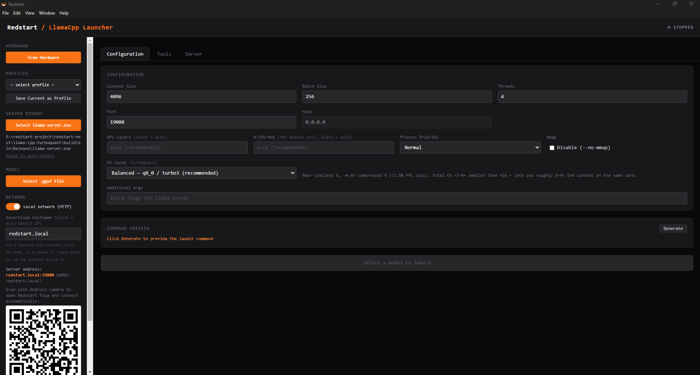
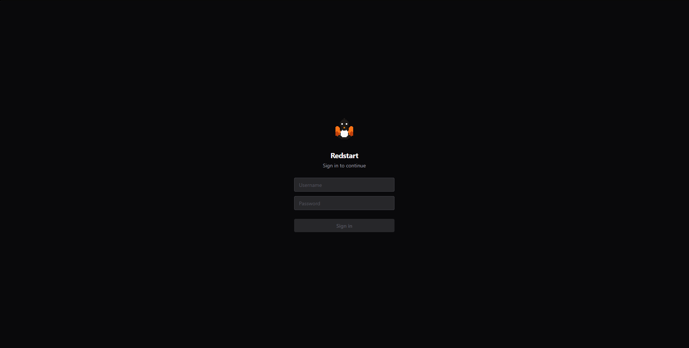
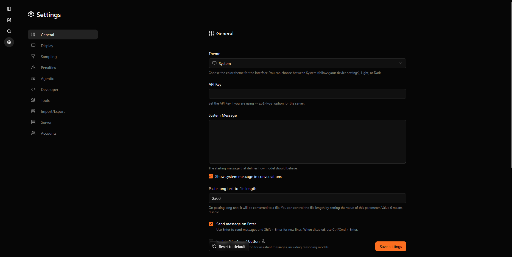
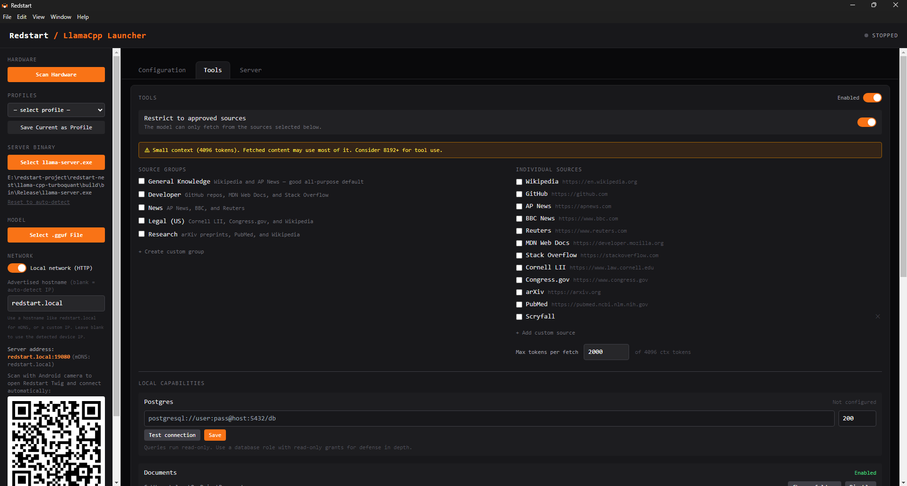
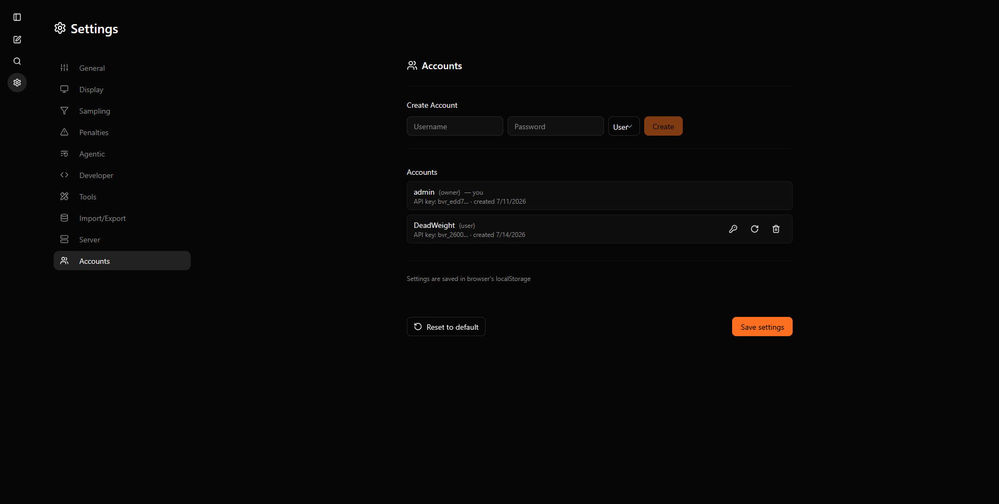

<p align="center">
  
</p>

# Redstart

**A local LLM ecosystem for home/office use.** Run a model on your PC to use it as a coding agent or chat with it from any device on your home network — phone, laptop, or another desktop — with no cloud, no subscriptions, and no data leaving your house.

---

## Contents
- [Mission](#mission)
- [What Is Redstart?](#what-is-redstart)
- [How It Works](#how-it-works)
- [Tools & MCP](#tools--mcp)
- [Accounts & Login](#accounts--login)
- [Using as a Coding Agent](#using-as-a-coding-agent-kilo-code--continue-etc)
- [Tested Configuration](#tested-configuration)
- [Requirements](#requirements)
- [Installation](#installation-end-users)
- [Development Setup](#development-setup)
- [Building Installers](#building-installers)
- [Roadmap](#roadmap)
- [Alternatives](#alternatives-worth-knowing-about)
- [Acknowledgements](#acknowledgements)

---

> **AI Assistance Disclosure**
> This project was developed using Claude Code as an AI pair programmer. I designed the product, architecture, user experience, and technical direction, while using Claude to accelerate implementation, debugging, and code generation. All design decisions and final technical choices were made by me.

---

## Screenshots

| Redstart Nest — server launcher | Login screen | Chat UI | Settings panel | Tools panel | Accounts tab |
|---|---|---|---|---|---|
|  |  |  |  |  |  |

---

## Origin

Redstart started as a personal frustration fix. Running llama.cpp meant remembering and typing out long command-line arguments every time — model path, context size, GPU layers, port, host. I wanted a UI where I could save those settings and hit a button.

The primary use case was a **local coding agent**: point Kilo Code (or any OpenAI-compatible coding extension) at a locally running model and have a capable AI assistant that works without a subscription and never sends code off-device. Everything else — the Android app, the QR code, the Windows client — grew from wanting that same server accessible on my phone from the couch.

The privacy angle is not an afterthought. My background is in social work, where you routinely handle information that genuinely should not leave the room. The idea of pasting case notes or client details into a cloud AI product is uncomfortable, but workloads in the field are often challenging, making tools like LLM workflows for documentation helpful. Running a model locally means the data stays on the machine — no API calls phoning home, no training pipeline, no terms of service to read carefully or settings to change.

**On the name:** the project was originally called *Beaver* (llama.cpp is named for an animal, and a beaver builds a dam — a fitting metaphor for keeping your AI use contained). It was renamed to **Redstart** to avoid a naming conflict with an established project in the same space. A redstart is a small bird, which keeps the animal theme alongside the llama. The naming carries through the pieces: the server that hosts the model is **Redstart Nest** (where the bird lives), and the lightweight clients that connect to it are **Redstart Twig**.

---

## Mission

Cloud AI services are priced to create dependency. A tool starts accessible, workflows get built around it, and then pricing changes — because it can. OpenAI, Microsoft Copilot, Google Gemini have all adjusted tiers, changed what's included, or shifted terms of service since launch. A small organization that builds its operations around any of them has no leverage and no guarantee those costs are stable next year.

Redstart's answer to that is simple: **own the hardware, run free software, pay once.**

A gaming PC with a capable GPU is a capital expense. It depreciates, but you own it. The model weights are a file you download. The software is open source. Nothing about any of that changes next year because a company decided to restructure its pricing.

**The liability problem is concrete, not abstract.**

For individuals and organizations in regulated fields, the question isn't just cost — it's whether cloud AI can be used at all without professional exposure:

- **Social work** — client confidentiality is a licensing requirement. Information leaving your network, even to a "secure" third-party service, is a legally uncomfortable position depending on jurisdiction.
- **Legal** — attorney-client privilege attaches to communications. Routing client details through a third-party API creates privilege questions most attorneys don't want to litigate.
- **Healthcare-adjacent** — HIPAA business associate agreements exist for this reason. Most cloud AI providers don't offer them outside enterprise tiers small organizations can't afford.
- **Education** — FERPA covers student records. Same problem.

For these organizations the question isn't "is cloud AI convenient?" It's "can we use it without liability?" For many the honest answer is no, or not without legal review they also can't afford.

**Local AI removes that question entirely.** If the data never leaves the building, there is no transmission, no third-party, no terms-of-service clause to parse. The model runs on your hardware. Your data stays on your hardware.

**Why open source matters here specifically.**

Beyond cost, open source software can be audited. In regulated industries that matters — you can verify what the software does and doesn't send. It can't be discontinued by a vendor decision. It can't be acquired and repriced. It doesn't lock you into a relationship with a company that may not exist in five years.

**The hardware case for small organizations.**

Grants fund capital expenditures. A purpose-built AI server is a line item in a capital grant application — something a foundation or government program can fund once. A recurring SaaS subscription competes with salaries and direct services every year and is harder to justify to funders.

The long-term goal of this project — a **Redstart Box**, a dedicated appliance that sits in the office and just works — is designed around this reality. A single hardware purchase, free software, zero ongoing cost. Staff on any device connect to it the way they'd connect to a printer. That's the shape a solution needs to take for a 6-person social work agency, a small legal aid clinic, or a community health provider that genuinely cannot afford enterprise AI and genuinely cannot send client data to the cloud.

The project isn't there yet. But that's the direction.

---

## What Is Redstart?

Redstart is a small ecosystem of apps built around [TurboQuant+](https://github.com/TheTom/llama-cpp-turboquant), a production-grade fork of [llama.cpp](https://github.com/ggerganov/llama.cpp) that adds advanced weight and KV-cache quantization. The core idea: your home PC probably has a GPU capable of running a decent LLM locally. Redstart makes it easy to start a model on that PC and reach it from any device on your home network.

There are two components:

| App | Platform | Role |
|---|---|---|
| **Redstart Nest** | Windows (Electron) | Server manager — loads and runs the model, manages tools/accounts, broadcasts its location on the LAN |
| **Redstart Twig** | Android (Capacitor) & Windows (Electron) | Client — scans for Redstart Nest automatically, or connect via QR code; same chat UI on both platforms |

Both share the same [SvelteKit](https://kit.svelte.dev/) chat frontend, which is a modified fork of the upstream llama.cpp web UI. The chat UI is also reachable directly in any browser — no client app required.

---

## How It Works

```
[ GPU PC ]                              [ Phone / Laptop / VS Code / Browser ]
  Redstart Nest                            Redstart Twig  /  Kilo Code
  ├─ Gateway     :19080 (public)       ├─ Scans LAN on port 8765
  │   └─ Injects Redstart context      ├─ Finds Redstart Nest automatically
  ├─ llama-server :19081 (localhost)   └─ Connects to http://IP:19080
  ├─ MCP server   :19082 (web_fetch, web_search, Postgres, Documents, SQLite, Vault, Git, File System, Scholar)
  ├─ Beacon      :8765
  └─ mDNS        redstart.local (advertises the server on the local network)
```

**Discovery:** Redstart Nest broadcasts a JSON beacon on port 8765 and advertises itself via mDNS as `redstart.local` by default (configurable). Redstart Twig (both Android and Windows) scans the local subnet on startup and connects automatically if a running server is found. No configuration required. On modern OSes you can also just type `http://redstart.local:19080` into a browser.

**QR Connect:** Redstart Nest displays a QR code in the UI when network mode is on. Scanning it with the Android camera opens Redstart Twig and connects to the server in one tap via a `redstart://connect` deep link.

**OpenAI-compatible API:** llama-server exposes `/v1/chat/completions` and related endpoints, so any tool that accepts a custom OpenAI base URL can use Redstart Nest as its backend — including coding agents, scripts, and API clients.

**Browser access:** When Redstart Nest is running, the chat UI is also accessible directly in any browser at `http://127.0.0.1:19080` (or `http://<LAN-IP>:19080` in network mode). No app required. If login is enabled, the browser shows the login screen first (see [Accounts & Login](#accounts--login)).

**HTTP only:** The LAN connection uses plain HTTP. HTTPS with self-signed certificates was tried and abandoned — Android WebView rejects them without manual cert trust, which is too much friction for a home tool. Proper transport security is on the roadmap, likely via a lightweight CA or certificate pinning approach, and becomes more important as the project moves toward small business use.

---

## Tools & MCP

Redstart Nest includes a built-in [Model Context Protocol](https://spec.modelcontextprotocol.io/) (MCP) server that gives the model access to live web content from approved sources — Wikipedia, GitHub, AP News, legal references, arXiv, PubMed, and others — plus local capabilities for file system access, read-only SQL (Postgres and SQLite), document generation, Obsidian-style vault search, git repository context, and academic literature search. All capabilities are off by default and configured per profile.

### Architecture

When the server starts, Redstart Nest launches three services alongside the AI model:

| Service | Port | Role |
|---|---|---|
| Gateway | `:19080` | Public-facing; injects Redstart identity + tool context into every completions request, and enforces login when accounts are enabled |
| llama-server | `:19081` | Inference engine; localhost-only, not reachable from LAN |
| MCP server | `:19082` | Exposes tools to the chat-ui via the MCP SSE protocol — `web_fetch`, `web_search`, Postgres, Documents, SQLite, Vault, Git, File System, and Scholar when enabled |

The MCP server itself is provider-driven: each capability (web_fetch, web_search, Postgres, Documents, SQLite, Vault, Git, File System, Scholar) is a self-contained module that declares its own tools and handles its own calls, and the server just merges tool lists and routes calls to the right provider. Adding a future capability means adding a provider module, not touching the transport.

The chat-ui's built-in agentic loop handles the full tool call cycle: it sees whichever tools are available via the MCP server, the model emits a tool call when it needs one, the chat-ui executes it through the MCP server, and the result feeds back into the next model turn — all with full streaming preserved.

### Centralized MCP management

MCP servers are managed in **one place — Redstart Nest** — not per device. The chat clients (browser, Redstart Twig) no longer carry their own MCP configuration UI; instead they fetch the active server list from Redstart Nest on startup and configure themselves automatically. Add or remove a tool server once in Redstart Nest, and every connected client picks up the change on its next load. This keeps a single source of truth for what tools exist and removes the need to reconfigure each device separately.

### Whitelist & SSRF Enforcement

The whitelist is enforced **at the MCP server level** — not just as a system prompt advisory. A request to a domain that is not on the approved list never leaves the machine. The MCP server validates every URL before the network call goes out and returns an `Access denied` error to the model if the domain is not whitelisted.

When the whitelist is toggled off, `web_fetch` still blocks private and loopback addresses (SSRF guard): RFC1918 ranges, `localhost`, `.local`, link-local, and IPv6 loopback are all rejected so the model cannot probe the LAN, the gateway, or a router admin page.

The gateway also injects the approved source list into the system context of every conversation, so the model knows which domains are available and can make appropriate tool calls without guessing. Redirects are validated hop-by-hop before being followed — a whitelisted page cannot silently bounce the fetch to a disallowed domain.

A law firm might approve only the specific legal databases their practice relies on, scoped to their local jurisdiction. Large models can conflate laws from different states when synthesizing across multiple sources; a whitelist restricted to one jurisdiction's databases reduces that risk at the source — and technical enforcement at the MCP layer means a jailbreak attempt in the prompt cannot override it.

### Source Groups

Tools are organized into **source groups** — named collections of web sources that can be activated together. The built-in groups are:

| Group | Sources |
|---|---|
| General Knowledge | Wikipedia, AP News |
| Developer | GitHub, MDN Web Docs, Stack Overflow |
| News | AP News, BBC, Reuters |
| Legal (US) | Cornell LII, Congress.gov, Wikipedia |
| Research | arXiv, PubMed, Wikipedia |

`web_search` is available alongside `web_fetch` for sources that expose a first-party search API (Wikipedia OpenSearch, arXiv, PubMed, MDN, Stack Exchange). No third-party search engine is ever involved — the query goes only to the site being searched.

These are proof-of-concept defaults. In practice, an organization defines their own groups from the sources they actually trust and control. A custom group for a specific use case — say, a healthcare provider's internal knowledge base plus PubMed — can be created in the UI and exported for deployment across multiple Redstart installations. Groups can be combined; their tool lists merge when multiple are active simultaneously.

### External MCP Servers

The **Tools** card in Redstart Nest also supports connecting to MCP servers running on **other devices**. An admin can enter any MCP SSE endpoint URL (e.g. `http://10.0.0.5:9000/sse`) and Redstart Nest will treat it as an additional tool source alongside the built-in server. This enables a few patterns:

- **Dedicated MCP appliance** — the MCP server runs on a separate machine (a small server, NAS, or the future Redstart Box) with more generous network access policies, separate from the AI model host
- **Shared company tool server** — one MCP server on the network serves multiple Redstart Nest installations without each needing its own whitelist configuration
- **Specialized tool sets** — a legal practice might run a separate MCP server that connects to their document management system or jurisdiction-specific databases

The Redstart Nest beacon (port 8765) advertises both the built-in MCP server URL and any active external servers, and chat clients fetch the same list from Redstart Nest directly, so every device on the LAN discovers the full tool set automatically.

### Local Capabilities

Beyond web sources, the built-in MCP server ships six local capabilities — all pure local I/O with no network egress, which is why they're built in rather than proxied to a hosted service:

- **Postgres** — `postgres_query`, `postgres_list_tables`, and `postgres_describe_table`. Every query runs inside a `BEGIN TRANSACTION READ ONLY` block, so Postgres itself rejects any write or DDL statement — enforcement happens at the database level, not by string-sniffing the query. Connect with a database role that's actually read-only for defense in depth.
- **Documents** — `create_document` writes a `.docx`, `.pdf`, or `.md` file to an admin-configured local folder. The model only ever supplies a title and content; the filename is derived server-side and checked to stay inside the configured folder, so the model can't write anywhere else on disk. The model can also read and summarize existing `.pdf`, `.docx`, `.txt`, `.md`, `.xlsx`, and `.csv` files in that folder. Useful for case notes, summaries, and reports — the kind of deliverable a social work, legal, or healthcare-adjacent office actually produces.
- **SQLite** — `sqlite_query`, `sqlite_list_tables`, and `sqlite_describe_table`. Read-only SQL access to local SQLite database files in an admin-configured folder. Same read-only enforcement model as Postgres.
- **Vault** — read-only access to a folder of markdown notes (Obsidian vault or any markdown folder). The model can search notes, read individual files, and browse tags — useful for organizations that keep their knowledge base in markdown.
- **Git** — read-only repository context from local git repositories in an admin-configured folder. The model can inspect status, recent commits, and uncommitted diffs — useful for code review and project context without giving the model write access.
- **File System** — general-purpose read/write access to a user-chosen folder. The model can read configs, write scripts, edit project files, and create documents. All paths pass through `resolveWithinRoot()`, which resolves symlinks and enforces containment so the model cannot escape the chosen root — even via symlinks planted inside it.

All are configured once globally (connection strings, output folders, or root directories) and then activated per profile, the same way web sources are — a profile can mix and match freely.

**Why not Context7 (or similar hosted "tool" MCP servers)?** We looked at it and passed. Context7 (and services like it) are proprietary hosted indexes with no self-hosted option — using one, even proxied through Redstart Nest's own MCP server, means the built-in server itself makes an outbound call on every use. That's a different risk category than the whitelisted web sources above, which are an explicit, visible, admin-controlled exception. A "built-in" tool silently phoning out conflicts with the "conversations stay on the local network" premise this whole project is built on, so it's off the table unless a genuinely local alternative shows up.

### Configuring in Redstart Nest

The **Tools** card appears in the main configuration panel between the model settings and the command preview. It has three sections:

**Web Sources** (top, toggle to enable/disable):
- Enable or disable source groups with checkboxes
- Toggle individual sources independently
- Create custom source groups from any combination of built-in or custom sources
- Add custom sources by URL and description
- Set the per-fetch token budget (default: 2000 tokens per fetch)

**Local Capabilities** (below Web Sources, inside the same card):
- Postgres: enter a connection string, test it, save — the string is encrypted at rest via the OS's own secret storage (DPAPI on Windows) and never re-displayed once saved
- Documents: pick an output folder with a native folder picker; the model can read existing documents and create new ones
- SQLite: pick a folder containing `.db`/`.sqlite` files with a native folder picker
- Vault: pick a folder of markdown notes with a native folder picker
- Git: pick a folder containing local git repositories with a native folder picker
- File System: pick a root folder with a native folder picker; all model file operations are confined to this root
- Scholar: optionally enter a journal/category whitelist to restrict academic search results
- Each capability can be individually enabled/disabled globally, and independently activated per profile in the same Individual Sources list as web sources

**External MCP Servers** (bottom, always visible):
- Shows the built-in Redstart MCP URL (`http://localhost:19082/sse`) when enabled
- Add external MCP servers by name and SSE URL
- Test connectivity to any configured server with a single click
- Remove servers that are no longer needed

All settings are saved with the active profile — different profiles can have different tool configurations.

### Performance

Each tool call adds 2–5 seconds of latency. The model's response appears after all fetches complete. Context sizes below 8192 tokens are flagged with a warning since fetched content competes with conversation history. Redstart Nest shows a red warning below 4096 tokens where tool use is likely to break the context entirely.

### Storage

User-defined tools, groups, external MCP server configurations, and local capability config (Postgres connection string, Documents/SQLite/Vault/Git/File System output folders, Scholar venue filter) are stored in `tools.json` in the Electron userData directory alongside `profiles.json`. Built-in sources, groups, and capabilities are hardcoded and can be toggled off per-profile but not deleted. The Postgres connection string is the one secret in that file — it's encrypted with Electron's `safeStorage` (OS-level encryption) rather than stored in plaintext.

Conversations are stored server-side in `conversations.json` in the same userData directory, scoped to the logged-in account. When login is off, conversations are scoped to a device-specific ID stored in the browser's localStorage, so each device keeps its own history. All conversations are automatically deleted after 30 days of inactivity.

---

## Accounts & Login

Redstart Nest has an optional account system, gated behind a global **Require login** toggle in the server settings. It's **on by default** — every client on the network, including the host machine's own browser, must authenticate before accessing the chat UI or API. With it off, anyone on your network can use the server with no login and no API key, exactly like a plain llama.cpp setup. Turn it on and the picture changes:

- **Login gate.** When accounts are required, the chat UI is not reachable until you sign in — a device that isn't logged in gets the login screen, not the chat. This holds for browsers on other devices too, not just the app.
- **Three-tier roles.** A single **Owner** creates and removes **Admin** accounts; Admins manage regular **Users** day-to-day; Users just log in and chat. Sessions are token-based and persist across app launches (they're held in memory server-side, so restarting Redstart Nest signs everyone out — clients handle that by returning to the login screen rather than erroring).
- **Account menu.** Logged-in users get an account menu in the sidebar header showing their username, role, account-created / last-login timestamps, and API key. From there they can **regenerate their own API key** (the new key is shown once) and **log out**.
- **API keys.** Each account has a long-lived API key (prefixed `rst_`) for OpenAI-compatible clients like Kilo Code. Only a hash is stored server-side, so an existing key is only ever shown as its prefix — regenerate to get a fresh full key. Admins can also manage keys for the accounts they oversee.
- **First run.** The Owner account is created in the Redstart Nest launcher itself — deliberately, there is no HTTP route for bootstrap, so creating the first account requires physical access to the host machine. Since login is on by default, do this before expecting any device (including a browser on the host PC) to sign in.

The account/role logic is covered by an automated HTTP-level test suite (`redstart-nest/scripts/test-auth.mjs`) that exercises the full hierarchy, including cross-tier permission checks. The login flow itself has been verified working from a remote browser. This is a newer subsystem — treat the account-management surface as still stabilizing, and **do not expose the gateway port to the public internet** regardless of whether login is on.

---

## Using as a Coding Agent (Kilo Code / Continue / etc.)

Since llama-server speaks the OpenAI API, any coding extension that accepts a custom base URL works out of the box.

**Kilo Code (VS Code extension):**
1. Open VS Code → Kilo Code settings
2. Set **API Provider** to `OpenAI Compatible`
3. Set **Base URL** to `http://127.0.0.1:19080/v1` (or your LAN IP if connecting from another machine)
4. Set **API Key** to your account's `rst_` API key (when login is on, which is the default); when login is off, any non-empty string works
5. Set **Model** to the name of your loaded model (e.g. `Qwen3.6-35B-A3B-UD-Q3_K_XL`)

The same pattern applies to [Continue](https://continue.dev/), [Aider](https://aider.chat/), or any tool with OpenAI-compatible configuration.

---

## Tested Configuration

This is the hardware and model used during development. Results will vary by GPU, quantization level, and task type.

| | |
|---|---|
| **CPU** | AMD Ryzen 7 7700X |
| **GPU** | NVIDIA RTX 3060 12 GB |
| **RAM** | 32 GB DDR5 |
| **Model** | [Qwen3.6-35B-A3B-UD-Q3_K_XL](https://huggingface.co/unsloth/Qwen3.6-35B-A3B-GGUF) |
| **Speed** | ~25–30 tokens/sec on light coding tasks and summarization; 41–45 tokens/sec generating a 5-page report (29s total) after letting llama-server's own `--fit` auto-size GPU/CPU offload instead of a fixed manual split — see Roadmap/Changelog for details |

**The model:** Qwen3.6-35B-A3B is an Alibaba model with a hybrid Gated DeltaNet and Gated Attention architecture, 256 experts with 8 routed and 1 shared active at a time — totalling ~3B active parameters out of 35B. That's why it fits and runs at useful speed on a 12 GB card that would be completely unusable with a dense 35B model.

**The quantization:** The `UD` prefix stands for Unsloth Dynamic — [Unsloth AI](https://huggingface.co/unsloth) applies different quantization levels to different layers intelligently rather than a flat bit-depth across the whole model. This gives meaningfully better output quality at the same file size compared to a standard K-quant. Credit to Unsloth for the conversion and for making this model accessible in GGUF format.

### Finding GGUF Models

The easiest source is [Hugging Face](https://huggingface.co). For the model above:

> **[unsloth/Qwen3.6-35B-A3B-GGUF](https://huggingface.co/unsloth/Qwen3.6-35B-A3B-GGUF)**

Unsloth provides multiple quantization variants. The `UD-Q3_K_XL` tested here fits comfortably in 12 GB of VRAM. Higher quantizations (Q4 and above) are available if you have more VRAM or are willing to offload some layers to system RAM.

[Unsloth](https://huggingface.co/unsloth) and [bartowski](https://huggingface.co/bartowski) are both reliable sources for well-quantized GGUF files across many model families.

---

## Requirements

### Redstart Nest (server)
- Windows 10/11
- A GPU with at least 6 GB VRAM (NVIDIA recommended; llama.cpp supports CUDA and Vulkan)
- A GGUF model file

### Redstart Twig (Android)
- Android 10 or later
- On the same Wi-Fi network as the Redstart Nest PC

### Redstart Twig (Windows)
- Windows 10/11
- On the same network as the Redstart Nest PC (or on the same machine)

---

## Installation (End Users)

### Redstart Nest
1. Download `Redstart Nest Setup 1.0.0.exe` from [Releases](../../releases)
2. Run the installer — Windows Defender may warn about an unsigned binary, click **More info → Run anyway**
3. Open Redstart Nest and **create the Owner account** in the sidebar's Accounts section. Login is required by default, so until an Owner exists no device — including a browser on this PC — can sign in to the chat UI. (Home users who don't want accounts can flip **Require login** off instead.)
4. Point it at a `.gguf` model file and click **Start Server**
5. Turn on **Local network** mode to make the server reachable from other devices — each person signs in with an account the Owner/Admins create

### Redstart Twig (Android)
1. Download `redstart-twig.apk` from [Releases](../../releases)
2. On your phone, allow installation from unknown sources (Settings → Apps → Special app access → Install unknown apps)
3. Install the APK
4. Open the app — it scans automatically, or scan the QR code in Redstart Nest to connect

### Redstart Twig (Windows)
1. Download `Redstart Twig Setup 1.0.0.exe` from [Releases](../../releases)
2. Install and open — it scans your network automatically

---

## Development Setup

### Prerequisites
- [Node.js](https://nodejs.org/) 20+
- [Android Studio](https://developer.android.com/studio) (for Android builds only)
- [Java 17+](https://adoptium.net/) (for Android builds only)

### Repository Layout

```
redstart-project/
├── redstart-nest/         # Redstart Nest Electron app (server manager)
│   ├── electron/          # Electron main process
│   ├── src/
│   │   ├── App.tsx        # React UI (the launcher window)
│   │   └── chat-ui/       # SvelteKit chat frontend (shared with all clients)
│   │       └── android/   # Capacitor Android project (Redstart Twig for Android)
│   └── electron-builder.json
└── redstart-twig/         # Redstart Twig client apps
    └── windows/           # Redstart Twig Windows Electron app
```

### Redstart Nest (dev mode)

```bash
cd redstart-nest
npm install
npm run dev
```

This starts Vite (React launcher UI), the SvelteKit chat-ui dev server, and Electron concurrently.

> **Note:** In dev mode the chat-ui runs on its own port (`:5174`). The `--path` flag that serves it through llama-server only applies in production builds.

### Chat UI only

```bash
cd redstart-nest/src/chat-ui
npm install
npm run dev:redstart
```

### Redstart Twig Windows (dev mode)

The Windows client has no dev server — it just loads the built chat-ui. Build the chat-ui first, then:

```bash
cd redstart-nest/src/chat-ui
npm run build

cd ../../../redstart-twig/windows
npm run dev
```

### Redstart Twig Android

```bash
cd redstart-nest/src/chat-ui
npm install
npm run build

npx cap sync android
```

Then open `redstart-nest/src/chat-ui/android` in Android Studio and run on a device or emulator.

---

## Building from Source — llama-server Binary

> **Just want to use it?** Download the installer from [Releases](../../releases) — the binaries are already bundled and no extra steps are needed.

For contributors building the installer from scratch: Redstart Nest bundles `llama-server.exe` and its supporting DLLs (compiled from [TurboQuant](https://github.com/TheTom/llama-cpp-turboquant)) at build time. These are not committed to this repository. You need to build TurboQuant first and place the output at `redstart-nest/llama-cpp-turboquant/build/bin/Release/`.

Follow [TurboQuant's build instructions](https://github.com/TheTom/llama-cpp-turboquant) — you will need the NVIDIA CUDA Toolkit and Visual Studio C++ build tools. Once built, `npm run build` picks up the binaries automatically.

---

## Building Installers

### Redstart Nest

```bash
cd redstart-nest
npm run build
```

Output: `redstart-nest/release/1.0.0/Redstart Nest Setup 1.0.0.exe`

### Redstart Twig Windows

```bash
cd redstart-twig/windows
npm run build
```

Output: `redstart-twig/windows/release/1.0.0/Redstart Twig Setup 1.0.0.exe`

The Windows build script builds the chat-ui first, then packages the Electron app. Both installers are NSIS-based and self-contained.

### Redstart Twig Android

Build an APK in Android Studio:
- **Build → Build App Bundle(s) / APK(s) → Build APK(s)**
- Signed APK goes to `app/build/outputs/apk/release/`

---

## Configuration

Redstart Nest stores its configuration at:

```
C:\Users\<you>\AppData\Roaming\redstart\profiles.json
```

Settings saved per profile:
- Model path
- Context size, batch size, thread count
- GPU layers
- Port (default: 19080) — llama-server uses `port + 1`, MCP server uses `port + 2` automatically
- Network mode (localhost vs LAN)
- Web source configuration (enabled/disabled, active source groups, per-fetch token budget)

User-defined tools, groups, and external MCP server connections are stored separately in:

```
C:\Users\<you>\AppData\Roaming\redstart\tools.json
```

The `tools.json` schema:
```json
{
  "tools": [ { "id": "...", "name": "...", "baseUrl": "...", "description": "..." } ],
  "groups": [ { "id": "...", "name": "...", "description": "...", "toolIds": ["..."] } ],
  "externalServers": [ { "id": "...", "name": "...", "url": "...", "enabled": true } ],
  "capabilities": {
    "postgres":  { "enabled": false, "connectionStringEnc": "...", "maxRows": 200 },
    "documents": { "enabled": false, "outputDir": "..." }
  }
}
```

Accounts (when login is enabled) are stored in `accounts.json` in the same directory. Passwords and API keys are stored only as hashes, never in plaintext.

> **Note on upgrading from Beaver:** on first launch, Redstart Nest migrates existing `profiles.json` / `accounts.json` / `tools.json` from the old `%APPDATA%\beaver\` directory to `%APPDATA%\redstart\` automatically (one-time, idempotent — it never overwrites files already present in the new location). API keys created under the old build keep their original `bvr_` prefix and continue to work; newly generated keys use `rst_`.

Profile management (save, load, delete) is available directly in the Redstart Nest UI.

---

## Ports Used

| Port | Purpose |
|---|---|
| 19080 | Gateway — public-facing; all clients connect here (default, configurable in Redstart Nest) |
| 19081 | llama-server — internal only, bound to `127.0.0.1`; not reachable from LAN |
| 19082 | MCP server — built-in tool endpoint (web_fetch, web_search, Postgres, Documents, SQLite, Vault, Git, File System, Scholar); LAN-accessible when network mode is on |
| 8765 | Beacon — Redstart Nest identity broadcast, always bound to `0.0.0.0` for LAN discovery |

Ports 19080 and 19082 are LAN-accessible when network mode is on (Redstart Nest adds Windows Firewall inbound rules automatically for both). Port 19081 is localhost only regardless of network mode. The gateway and its two internal services shift together if you change the configured port — llama-server is always `configured-port + 1`, and the MCP server is always `configured-port + 2`.

---

## Known Limitations

- **Unsigned installers** — both installers will trigger Windows Defender SmartScreen. This is expected for unsigned binaries distributed outside the Microsoft Store. A code signing certificate would resolve this.
- **Android sideload required** — the app is not on the Play Store. Installation requires enabling "unknown sources."
- **Accounts are on by default** — Redstart Nest supports a three-tier account model (Owner → Admin → User), session tokens, and `rst_` API keys behind a global "Require login" toggle, with a login gate, an account/profile menu, and self-service key regeneration (see [Accounts & Login](#accounts--login)). The account/role logic has an automated HTTP-level test suite and remote-browser login has been verified. With login on (the default), every client on the LAN must authenticate. Do not expose the gateway port to the public internet.
- **Single profile active at a time** — Redstart Nest manages one running model at a time.
- **Windows only for server** — Redstart Nest is Windows-only. The client apps (Redstart Twig) can run anywhere, but the server manager requires Windows because it shells out to a Windows llama.cpp binary.
- **Tokens/min display is unreliable** — the tok/min counter shown in the Redstart Nest header is a known bug. The number it displays is not accurate. This is a known issue and will be fixed in a future update.
- **mDNS requires compatible clients** — `redstart.local` resolves natively on macOS and Linux; Windows 10+ resolves it via LLMNR on the same subnet. If a client can't resolve it, use the IP address directly or install Apple Bonjour on Windows.

---

## Roadmap

This is an honest work-in-progress. The project started as a personal home tool and is evolving toward a private AI solution for small organizations. The roadmap reflects that shift in priority.

### Working Now
- [x] Start/stop llama.cpp model from a GUI
- [x] LAN network mode with automatic port binding
- [x] Beacon-based zero-configuration device discovery
- [x] Android app with automatic LAN scan on launch
- [x] QR code deep link — scan to open app and auto-connect
- [x] Windows desktop client (Redstart Twig)
- [x] Shared SvelteKit chat UI across all clients
- [x] Server log displayed in Redstart Nest UI (piped mode)
- [x] OpenAI-compatible API for use with coding agents (Kilo Code, Continue, etc.)
- [x] Direct browser access to chat UI at `http://127.0.0.1:19080`
- [x] Built-in MCP server — provider-driven architecture exposing `web_fetch`, Postgres, and Document-generation tools via Model Context Protocol SSE transport; whitelist enforced at the server level (non-whitelisted URLs never leave the machine)
- [x] Centralized MCP management — tool servers are configured once in Redstart Nest and auto-discovered by every client; per-device MCP config removed
- [x] Source groups — named bundles of web sources (General Knowledge, Developer, News, Legal US, Research) with per-profile activation; custom groups and sources supported
- [x] External MCP server management — connect to MCP servers on other devices; beacon advertises all active MCP endpoints for auto-discovery
- [x] Postgres capability — read-only SQL query, table listing, and column inspection against an admin-configured database; read-only enforced by the database itself (queries run inside a `READ ONLY` transaction), connection string encrypted at rest
- [x] Document generation capability — model can create `.docx`/`.pdf`/`.md` files in an admin-configured local output folder for case notes, summaries, and reports
- [x] Three-tier accounts with login gate — Owner/Admin/User roles, session tokens, `rst_` API keys, a login screen that guards the chat UI (remote browsers included), an account/profile menu, and self-service key regeneration; auth on by default, localhost bypass removed
- [x] `web_search` tool — first-party search APIs (Wikipedia OpenSearch, arXiv, PubMed, MDN, Stack Exchange); no third-party search engine involved
- [x] SQLite capability — read-only SQL query, table listing, and column inspection against local SQLite database files in an admin-configured folder
- [x] Vault capability — read-only search and read access to a folder of markdown notes (Obsidian vault or any markdown folder), including tag browsing
- [x] Git capability — read-only repository context (status, recent commits, uncommitted diffs) from local git repositories in an admin-configured folder
- [x] File System capability — read and write files within a user-chosen root directory (`fs_read_file`, `fs_write_file`, `fs_edit_file`, `fs_list_directory`, `fs_search_files`, `fs_get_file_info`, `fs_create_directory`, `fs_delete_file`); path containment enforced via symlink-aware `resolveWithinRoot()`, binary extension blocking, and a 50 MB file size limit
- [x] Scholar capability — search open academic literature (OpenAlex, arXiv, PubMed) with abstracts, citations, and open-access PDFs saved into the Documents folder; optional journal/category whitelist
- [x] Security hardening — beacon returns minimal `{ running, port }` payload only (no version, auth state, MCP URLs, or LAN IPs); SSRF guard blocks loopback/RFC1918/link-local for `web_fetch`; web fetch redirects validated hop-by-hop; path containment utility shared across all file-based capabilities; chat-ui context compaction service

### Phase 2 — Small Office Ready
Making Redstart usable in a small workplace rather than just on one person's home network.

- [x] Per-user conversation history — conversations are stored server-side in `conversations.json`, scoped to the logged-in account (or device ID when auth is off), and sync across all devices on the network; unused conversations auto-delete after 30 days
- [x] mDNS discovery — server advertises as `redstart.local` by default (configurable); clients can connect by hostname instead of IP
- [ ] Guided onboarding & in-app instruction — first-run walkthrough (create the Owner account, pick a model, launch), contextual help on the tools/capabilities panels, and plain-language explanations aimed at non-technical staff in a small office
- [ ] Admin interface accessible from any device on the network — manage the server without touching the host PC
- [ ] Auto-restart on crash — if the model dies at 9am Monday, it recovers without manual intervention
- [ ] Signed installers — removes the Windows Defender SmartScreen warning, looks professional in a workplace setting
- [ ] macOS support — many non-profits and small agencies run Macs

### Phase 3 — The Redstart Box (Office Appliance)
The long-term goal: a purpose-built machine that sits in the office and runs the model headlessly. No monitor, no babysitting — staff connect to it the way they'd connect to a printer, from any device on the network.

- [ ] Headless / service mode — Redstart Nest runs as a background service with no launcher window required
- [ ] Web-based admin UI — manage everything from a browser on any device on the network
- [ ] Linux support — run on a dedicated mini PC, NAS, or low-power server
- [ ] Auto-start on boot
- [ ] Document querying (RAG) — staff can upload policy manuals, templates, and reference documents and query against them
- [ ] iOS client (Redstart Twig for iPhone)
- [ ] Model library management — browse, download, and switch models from any client device

### Honest Shortcoming
The reliability bar for a small business is materially higher than for a personal home project. If this is running in a social work office and the server crashes mid-day, staff need it to recover on its own — not wait for someone technical to fix it. That kind of robustness requires systems and operations experience that is currently a gap in this project. It is acknowledged here openly rather than papered over. Contributions from developers with reliability or infrastructure background are particularly welcome.

---

## Acknowledgements

- [llama.cpp](https://github.com/ggerganov/llama.cpp) — the inference engine that makes all of this possible
- [TurboQuant](https://github.com/TheTom/llama-cpp-turboquant) — the llama.cpp build and quantization tooling used here; the included `llama-server.exe` comes from this project
- [Unsloth](https://huggingface.co/unsloth) — pre-quantized GGUF models including the Qwen 3.6 model used during development
- [llama.cpp web UI](https://github.com/ggerganov/llama.cpp/tree/master/examples/server) — the upstream chat UI that the Redstart chat frontend is forked from

---

## License

See [LICENSE.txt](redstart-nest/LICENSE.txt).

---

## Alternatives Worth Knowing About

If you just want to run a model on a single PC, these are more mature options:

- **[LM Studio](https://lmstudio.ai/)** — polished GUI, built-in model browser, downloads GGUFs directly, OpenAI-compatible server. Windows/Mac/Linux.
- **[Jan](https://jan.ai/)** — similar to LM Studio, fully open source.
- **[Ollama](https://ollama.com/)** — CLI-first but extremely simple (`ollama run qwen3`), large ecosystem of community UIs built on top.

All three can technically be reached from other devices on your LAN if you manually configure them to bind to `0.0.0.0` — but you are then on your own for finding the IP address and entering it in whatever client you use. None have a mobile app that discovers the server automatically, and none have a QR-to-connect flow.

Redstart's niche is making the **home network experience feel like a first-class feature** rather than a manual network configuration exercise. If single-PC use is all you need, LM Studio is probably the better starting point.

---

## Author

Patrick Carswell — this is my first major development project, built to solve a personal problem: running a local AI on existing home hardware without sending data to the cloud. My background is in social work, not software, so some of the architecture decisions here reflect learning-by-doing as much as deliberate design. The codebase reflects that honestly.
