<p align="center">
  
</p>

# Redstart

**A self-hosted AI ecosystem for home and small-office use.** Redstart Nest runs local models on hardware you own and exposes them to the applications you work in — chat from your phone or laptop, query your data, or drive a coding agent in your IDE. You choose the models, decide which applications and users can connect, and control what those tools can reach.

**The apps:** [Nest](#the-apps) (the server) · [Twig](#the-apps) (chat client) · [Blueprints](https://github.com/ImDeadWeight/redstart-blueprints) (SQL data workbench - in progress) · [Yellowscript](https://github.com/ImDeadWeight/redstart-yellowscript) (VS Code Extension - in progress) · [Greenhouse](https://github.com/ImDeadWeight/redstart-greenhouse) (project management, planned)

**Documentation:** [Mission](docs/mission.md) · [Architecture](docs/architecture.md) · [Security](docs/security.md) · [Capabilities](docs/capabilities.md) · [Configuration](docs/configuration.md) · [Development](docs/development.md) · [Roadmap](docs/roadmap.md)

---

> **AI Assistance Disclosure**
> This project was developed using Claude Code as an AI pair programmer. I designed the product, architecture, user experience, and technical direction, while using Claude to accelerate implementation, debugging, and code generation. All design decisions and final technical choices were made by me.

---

## Screenshots

**Redstart Nest — server launcher**

| Configuration | Models | Tools | Server |
|---|---|---|---|
| 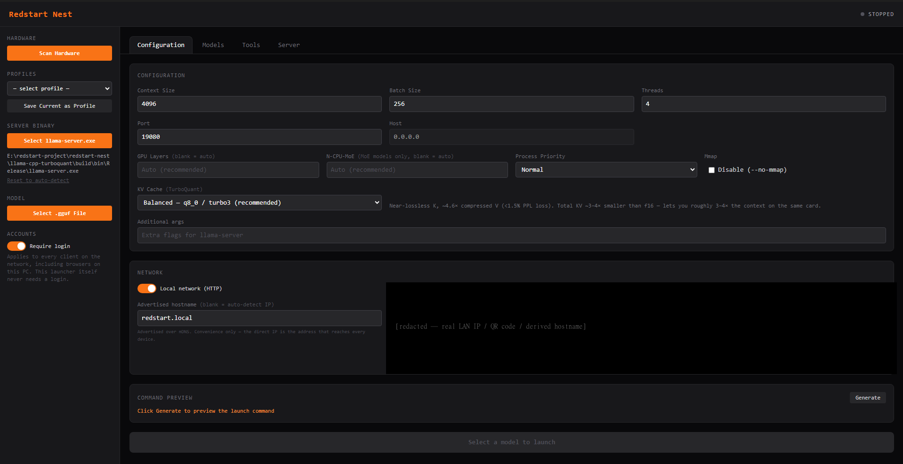 | 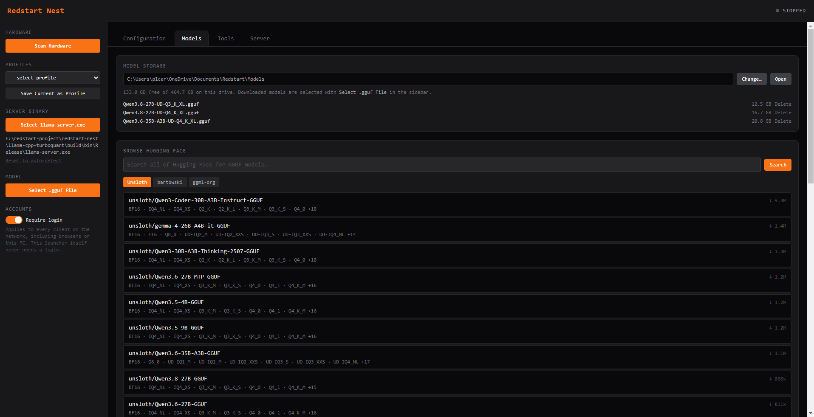 | 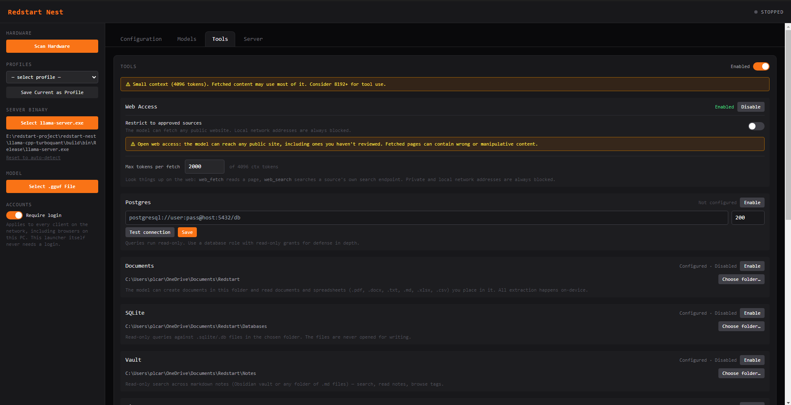 | 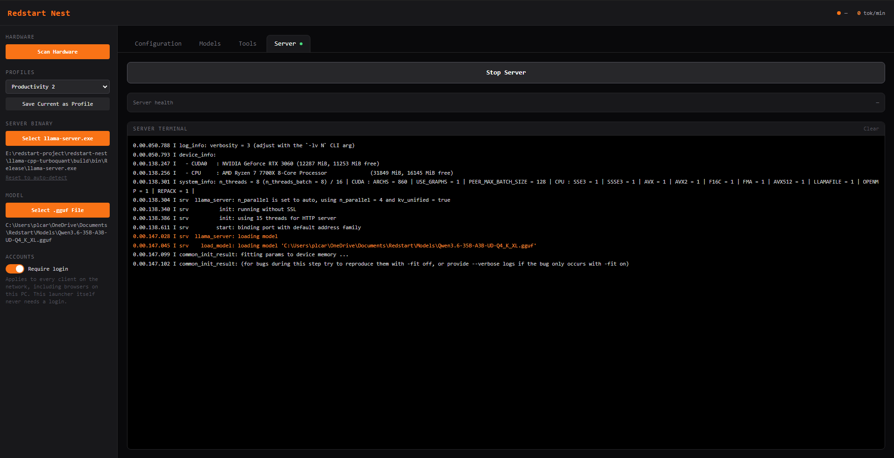 |

**Redstart Twig / chat UI**

| Login | Chat | Settings — General | Settings — Tools | Settings — Accounts |
|---|---|---|---|---|
| 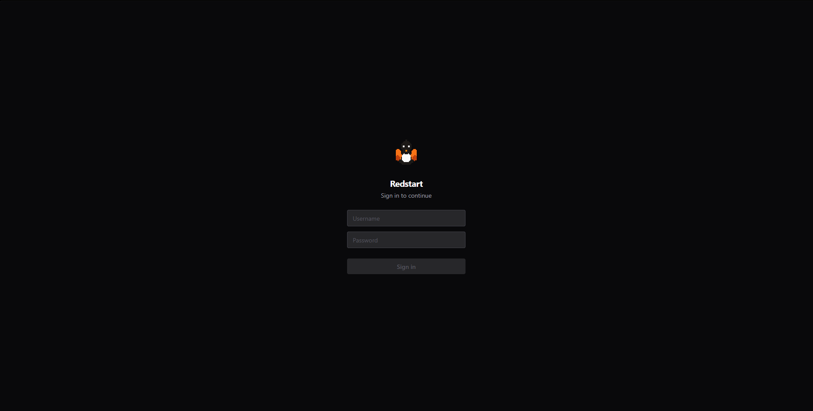 | 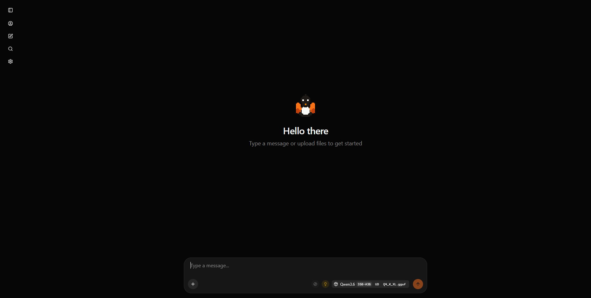 | 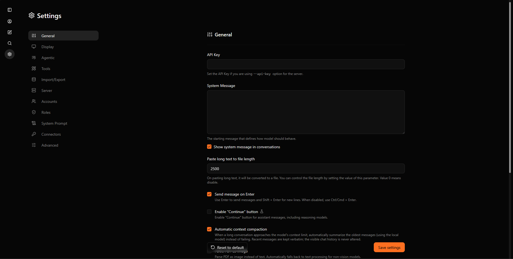 | 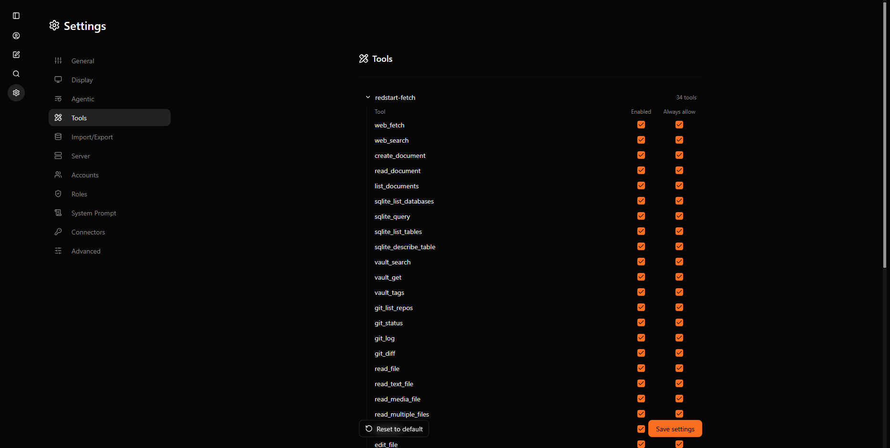 | 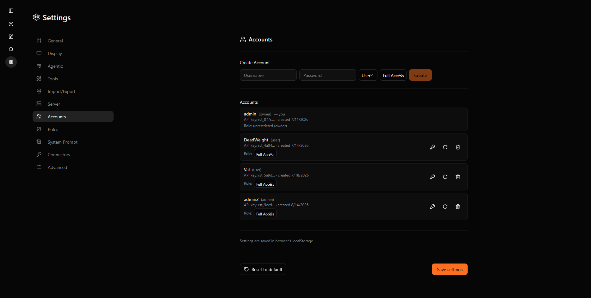 |

| Settings — Roles | Settings — System Prompt | Settings — Connectors | Your account | Your files |
|---|---|---|---|---|
| 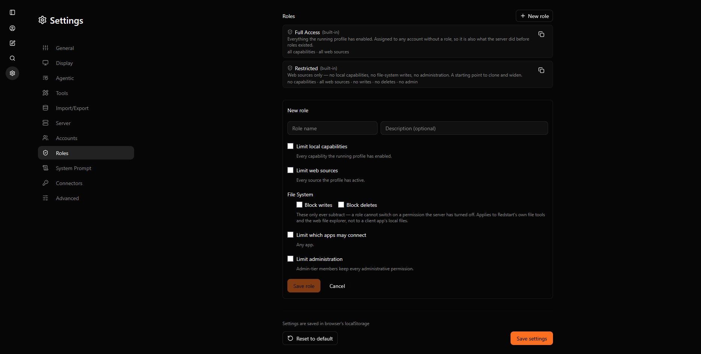 | 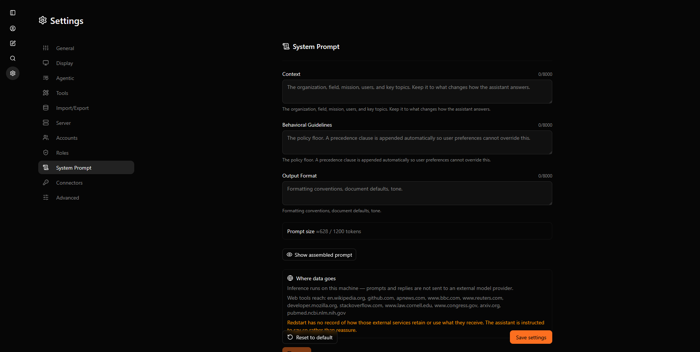 | 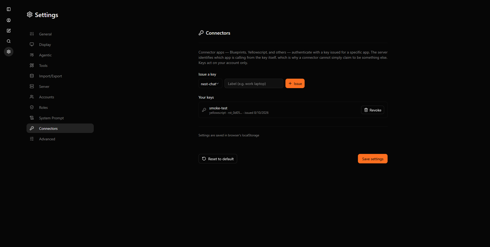 | 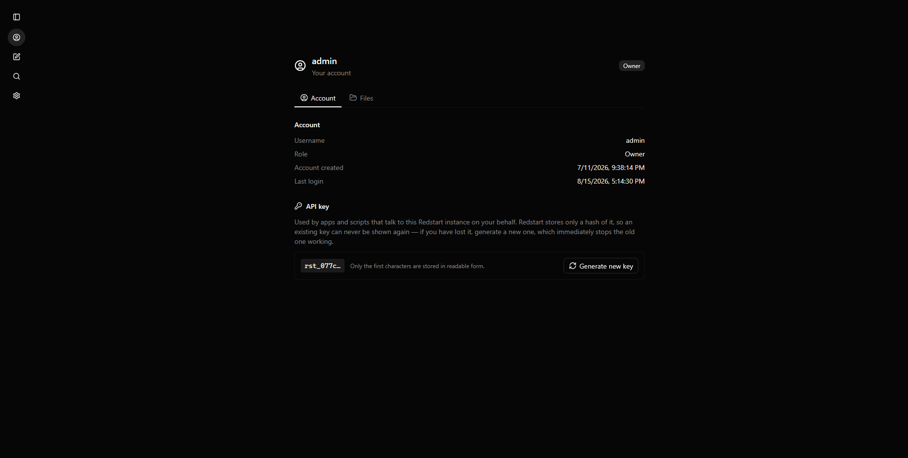 | 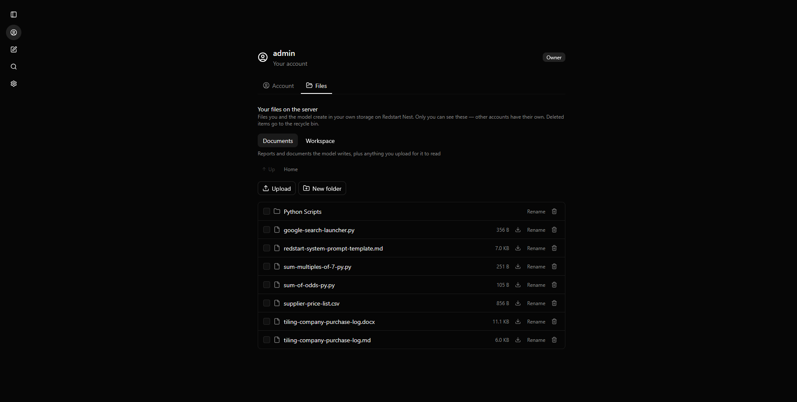 |

---

## The apps

Redstart is an ecosystem around one idea: a model you own, running on hardware you own, reachable from every tool you work in. **Redstart Nest hosts the model, the tools, and the policy. Everything else is a client** that finds it on the network, signs in with a Redstart account, and gets the same capabilities the admin configured once.

| App | Platform | Role | Status |
|---|---|---|---|
| **Redstart Nest** | Windows (Electron) | Server manager — runs the model, hosts the tools, accounts and policy, and broadcasts itself on the LAN | In this repo |
| **Redstart Twig** | Android & Windows | Lightweight chat client; finds Nest automatically, no configuration | In this repo — Windows working; **Android build out of date, [see note](#redstart-twig-android)** |
| **[Redstart Blueprints](https://github.com/ImDeadWeight/redstart-blueprints)** | Windows (Electron) | Local-first SQL data workbench with optional AI assistance | Separate repo |
| **[Redstart Yellowscript](https://github.com/ImDeadWeight/redstart-yellowscript)** | VS Code extension | A coding agent that talks to a local Nest instead of a cloud | Separate repo |
| **[Redstart Greenhouse](https://github.com/ImDeadWeight/redstart-greenhouse)** | Windows (Electron), planned | Project management, built the way Blueprints is built | Not yet started |

The integration points are contracts, not conventions: every client authenticates with a per-connector key that carries its own *surface*, so the server knows which app is calling from the credential rather than a header it could fake. See [Architecture](docs/architecture.md) for the full picture.

---

## How it works

```
[ GPU PC ]                              [ Phone / Laptop / VS Code / Browser ]
  Redstart Nest                            Redstart Twig  /  Kilo Code
  ├─ Gateway     :19080 (LAN in network mode) ├─ Scans LAN on port 8765
  │   └─ Injects Redstart context      ├─ Finds Redstart Nest automatically
  ├─ llama-server :19081 (localhost)   └─ Connects to http://IP:19080
  ├─ MCP server   :19082 (web_fetch, web_search, Postgres, Documents, SQLite, Vault, Git, File System, Scholar)
  ├─ Beacon      :8765
  └─ mDNS        redstart.local (advertises the server on the local network)
```

Redstart Nest broadcasts a beacon on the LAN, so Twig finds it with no configuration and a phone camera can open the chat UI from a QR code. The chat UI is also reachable in any browser at `http://127.0.0.1:19080` — no app required. Since llama-server speaks the OpenAI API, any coding agent that accepts a custom base URL works against it.

Details: [Architecture](docs/architecture.md) · [Capabilities](docs/capabilities.md) · [Security](docs/security.md)

---

## Control, not isolation

Inference is local and architecturally so — llama-server runs on your machine, bound to loopback, and nothing about a conversation is transmitted anywhere by default. What *can* leave is exactly what an administrator turns on: approved web domains, academic search, or an external tool server on another host. Each is an explicit, auditable choice.

The honest one-line version is **local inference with administrator-controlled egress**, and the server will tell you the live answer — `GET /egress` returns which domains are approved, which tool servers are remote, and which local stores exist. See [Security → What actually leaves the machine](docs/security.md#what-actually-leaves-the-machine).

Accounts are **on by default** with no localhost exemption, and each account's files are structurally isolated from every other's. **Do not expose the gateway port to the public internet.**

---

## Requirements

**Redstart Nest (server)**
- Windows 10/11
- A GPU with at least 6 GB VRAM (NVIDIA recommended; llama.cpp supports CUDA and Vulkan)
- A GGUF model file

**Redstart Twig (Android)** — Android 10 or later, on the same Wi-Fi network as the Nest PC. **Not currently working** — [see note](#redstart-twig-android).

**Redstart Twig (Windows)** — Windows 10/11, on the same network as the Nest PC (or on the same machine).

---

## Installation

> **Alpha software.** Releases are published as prereleases and versioned
> `1.0.0-alpha.N`. Expect rough edges, and do not run this where losing data or
> exposing a service would matter.

### Redstart Nest
1. Download the latest `Redstart Nest Setup 1.0.0-alpha.N.exe` from [Releases](../../releases)
2. Run the installer — Windows Defender may warn about an unsigned binary, click **More info → Run anyway**
3. Open Redstart Nest and **create the Owner account** in the sidebar's Accounts section. Login is required by default, so until an Owner exists no device — including a browser on this PC — can sign in to the chat UI. (Home users who don't want accounts can flip **Require login** off instead.)
4. Point it at a `.gguf` model file and click **Start Server**
5. In **Configuration → Network**, turn on **Local network** mode to make the server reachable from other devices — each person signs in with an account the Owner/Admins create. The same panel shows the addresses to browse to, including a QR code to scan from a phone

### Redstart Twig (Android)

> **Currently out of date and not working.** The Android client has fallen behind
> the server and has not been rebuilt against recent Nest changes; the published
> APK should not be relied on. This is paused, not abandoned — returning to it is
> planned, but it is not being worked on right now.
>
> **In the meantime, use a phone browser instead.** The chat UI is served directly
> by Nest, so browsing to `http://<nest-ip>:19080` — or scanning the QR code in
> **Configuration → Network** — gives you the same interface on Android with no app
> installed. Redstart Twig for Windows is unaffected and works normally.

1. Download `redstart-twig.apk` from [Releases](../../releases)
2. On your phone, allow installation from unknown sources (Settings → Apps → Special app access → Install unknown apps)
3. Install the APK
4. Open the app — it finds the server automatically by scanning the LAN for the beacon on port 8765; no hostname or QR code needed

### Redstart Twig (Windows)
1. Download the latest `Redstart Twig Setup 1.0.0-alpha.N.exe` from [Releases](../../releases)
2. Install and open — it scans your network automatically

---

## Using as a coding agent (Kilo Code / Continue / etc.)

Since llama-server speaks the OpenAI API, any coding extension that accepts a custom base URL works out of the box.

**Kilo Code (VS Code extension):**
1. Open VS Code → Kilo Code settings
2. Set **API Provider** to `OpenAI Compatible`
3. Set **Base URL** to `http://127.0.0.1:19080/v1` (or your LAN IP if connecting from another machine)
4. Set **API Key** to your account's `rst_` API key (when login is on, which is the default); when login is off, any non-empty string works
5. Set **Model** to the name of your loaded model (e.g. `Qwen3.6-35B-A3B-UD-Q3_K_XL`)

The same pattern applies to [Continue](https://continue.dev/), [Aider](https://aider.chat/), or any tool with OpenAI-compatible configuration.

---

## Tested configuration

This is the hardware and model used during development. Results will vary by GPU, quantization level, and task type.

| | |
|---|---|
| **CPU** | AMD Ryzen 7 7700X |
| **GPU** | NVIDIA RTX 3060 12 GB |
| **RAM** | 32 GB DDR5 |
| **Model** | [Qwen3.6-35B-A3B-UD-Q3_K_XL](https://huggingface.co/unsloth/Qwen3.6-35B-A3B-GGUF) |
| **Speed** | ~25–30 tokens/sec on light coding tasks and summarization; 41–45 tokens/sec generating a 5-page report (29s total) after letting llama-server's own `--fit` auto-size GPU/CPU offload instead of a fixed manual split |

**The model:** Qwen3.6-35B-A3B is an Alibaba model with a hybrid Gated DeltaNet and Gated Attention architecture, 256 experts with 8 routed and 1 shared active at a time — totalling ~3B active parameters out of 35B. That's why it fits and runs at useful speed on a 12 GB card that would be completely unusable with a dense 35B model.

**The quantization:** The `UD` prefix stands for Unsloth Dynamic — [Unsloth AI](https://huggingface.co/unsloth) applies different quantization levels to different layers intelligently rather than a flat bit-depth across the whole model. This gives meaningfully better output quality at the same file size compared to a standard K-quant.

**Finding GGUF models:** [Hugging Face](https://huggingface.co) is the easiest source — [unsloth](https://huggingface.co/unsloth) and [bartowski](https://huggingface.co/bartowski) are both reliable for well-quantized GGUF files across many model families. The `UD-Q3_K_XL` tested here fits comfortably in 12 GB of VRAM.

---

## Known limitations

The short list; the [full set is in the roadmap](docs/roadmap.md#known-limitations).

- **Twig for Android is out of date and not working** — the Android client hasn't been rebuilt against recent server changes. Use a phone browser against the chat UI instead. Paused, not abandoned; see [the note above](#redstart-twig-android).
- **Unsigned installers** — both will trigger Windows Defender SmartScreen.
- **Windows only for the server** — the clients run anywhere, but Nest shells out to a Windows llama.cpp binary.
- **Sessions don't survive a restart** — tokens are held in memory, so restarting Nest signs everyone out.
- **HTTP only on the LAN** — self-signed TLS was tried and abandoned; Android WebView rejects it.
- **`redstart.local` does not work on Android** and cannot be made to. Use the IP or the QR code.
- **Shared capabilities are all-or-nothing** — Vault, Git, SQLite and Postgres are shared across every account, with no per-account grants yet.

---

## Development

```bash
cd redstart-nest
npm install
npm install --prefix src/chat-ui   # the chat-ui is its own package
npm run dev
```

Full setup, repo layout, test commands and installer builds: [Development](docs/development.md).

---

## Alternatives worth knowing about

If you just want to run a model on a single PC, these are more mature options:

- **[LM Studio](https://lmstudio.ai/)** — polished GUI, built-in model browser, downloads GGUFs directly, OpenAI-compatible server. Windows/Mac/Linux.
- **[Jan](https://jan.ai/)** — similar to LM Studio, fully open source.
- **[Ollama](https://ollama.com/)** — CLI-first but extremely simple (`ollama run qwen3`), large ecosystem of community UIs built on top.

All three can technically be reached from other devices on your LAN if you manually configure them to bind to `0.0.0.0` — but you are then on your own for finding the IP address and entering it in whatever client you use. None have a mobile app that discovers the server automatically, and none have a QR-to-connect flow.

Redstart's niche is two things those don't try to be: making the **home network experience a first-class feature** rather than a manual network-configuration exercise, and being an **ecosystem of applications** — chat, data workbench, IDE agent, project management — that all share one server, one account system, and one tool policy. If single-PC use is all you need, LM Studio is probably the better starting point.

---

## Acknowledgements

- [llama.cpp](https://github.com/ggerganov/llama.cpp) — the inference engine that makes all of this possible
- [TurboQuant](https://github.com/TheTom/llama-cpp-turboquant) — the llama.cpp build and quantization tooling used here; the included `llama-server.exe` comes from this project
- [Unsloth](https://huggingface.co/unsloth) — pre-quantized GGUF models including the Qwen 3.6 model used during development
- [llama.cpp web UI](https://github.com/ggerganov/llama.cpp/tree/master/examples/server) — the upstream chat UI that the Redstart chat frontend is forked from

---

## License

See [LICENSE.txt](redstart-nest/LICENSE.txt).

---

## Author

Patrick Carswell — this is my first major development project, built to solve a personal problem: running a local AI on existing home hardware without sending data to the cloud. My background is in social work, not software, so some of the architecture decisions here reflect learning-by-doing as much as deliberate design. The codebase reflects that honestly.
