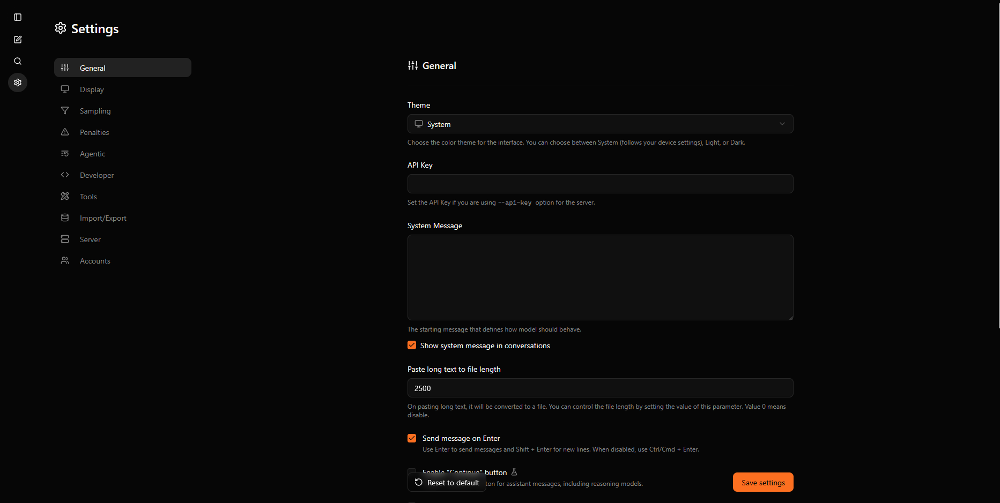
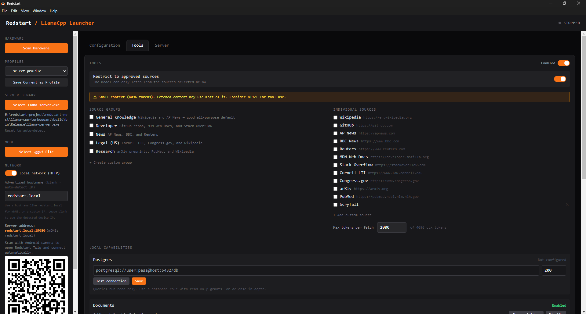
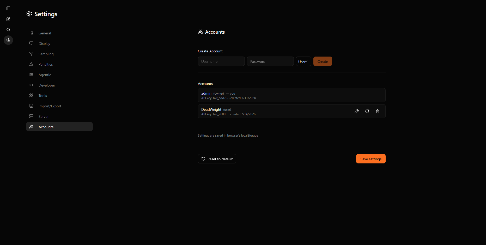

<p align="center">
  
</p>

# Redstart

**A local LLM ecosystem for home/office use.** Run a model on your own PC, then reach it from every tool you work in — chat from your phone or laptop, query your data, or drive a coding agent in your IDE — with no cloud, no subscriptions, and no data leaving your building.

**The apps:** [Nest](#what-is-redstart) (the server) · [Twig](#what-is-redstart) (chat client) · [Blueprints](https://github.com/ImDeadWeight/redstart-blueprints) (SQL data workbench) · [Yellowscript](https://github.com/ImDeadWeight/redstart-yellowscript) (VS Code agent) · [Greenhouse](https://github.com/ImDeadWeight/redstart-greenhouse) (project management, planned)

---

## Contents
- [Mission](#mission)
- [What Is Redstart?](#what-is-redstart) — the app ecosystem
- [How It Works](#how-it-works)
- [Tools & MCP](#tools--mcp)
- [Per-account file storage](#per-account-file-storage)
- [Accounts & Login](#accounts--login)
- [System Prompt & Task Modes](#system-prompt--task-modes)
- [Using as a Coding Agent](#using-as-a-coding-agent-kilo-code--continue--etc)
- [Tested Configuration](#tested-configuration)
- [Requirements](#requirements)
- [Installation](#installation-end-users)
- [Development Setup](#development-setup)
- [Building Installers](#building-installers)
- [Roadmap](#roadmap)
- [Alternatives](#alternatives-worth-knowing-about)
- [Acknowledgements](#acknowledgements)

---

> **AI Assistance Disclosure**
> This project was developed using Claude Code as an AI pair programmer. I designed the product, architecture, user experience, and technical direction, while using Claude to accelerate implementation, debugging, and code generation. All design decisions and final technical choices were made by me.

---

## Screenshots

| Redstart Nest — server launcher | Login screen | Chat UI | Settings panel | Tools panel | Accounts tab |
|---|---|---|---|---|---|
|  |  |  |  |  |  |

---

## Origin

Redstart started as a personal frustration fix. Running llama.cpp meant remembering and typing out long command-line arguments every time — model path, context size, GPU layers, port, host. I wanted a UI where I could save those settings and hit a button.

The primary use case was a **local coding agent**: point Kilo Code (or any OpenAI-compatible coding extension) at a locally running model and have a capable AI assistant that works without a subscription and never sends code off-device. Everything else — the Android app, the QR code, the Windows client — grew from wanting that same server accessible on my phone from the couch.

The privacy angle is not an afterthought. My background is in social work, where you routinely handle information that genuinely should not leave the room. The idea of pasting case notes or client details into a cloud AI product is uncomfortable, but workloads in the field are often challenging, making tools like LLM workflows for documentation helpful. Running a model locally means the data stays on the machine — no API calls phoning home, no training pipeline, no terms of service to read carefully or settings to change.

**On the name:** the project was originally called *Beaver* (llama.cpp is named for an animal, and a beaver builds a dam — a fitting metaphor for keeping your AI use contained). It was renamed to **Redstart** to avoid a naming conflict with an established project in the same space. A redstart is a small bird, which keeps the animal theme alongside the llama. The naming carries through the pieces: the server that hosts the model is **Redstart Nest** (where the bird lives), and the lightweight clients that connect to it are **Redstart Twig**.

---

## Mission

Cloud AI services are priced to create dependency. A tool starts accessible, workflows get built around it, and then pricing changes — because it can. OpenAI, Microsoft Copilot, Google Gemini have all adjusted tiers, changed what's included, or shifted terms of service since launch. A small organization that builds its operations around any of them has no leverage and no guarantee those costs are stable next year.

Redstart's answer to that is simple: **own the hardware, run free software, pay once.**

A gaming PC with a capable GPU is a capital expense. It depreciates, but you own it. The model weights are a file you download. The software is open source. Nothing about any of that changes next year because a company decided to restructure its pricing.

**The liability problem is concrete, not abstract.**

For individuals and organizations in regulated fields, the question isn't just cost — it's whether cloud AI can be used at all without professional exposure:

- **Social work** — client confidentiality is a licensing requirement. Information leaving your network, even to a "secure" third-party service, is a legally uncomfortable position depending on jurisdiction.
- **Legal** — attorney-client privilege attaches to communications. Routing client details through a third-party API creates privilege questions most attorneys don't want to litigate.
- **Healthcare-adjacent** — HIPAA business associate agreements exist for this reason. Most cloud AI providers don't offer them outside enterprise tiers small organizations can't afford.
- **Education** — FERPA covers student records. Same problem.

For these organizations the question isn't "is cloud AI convenient?" It's "can we use it without liability?" For many the honest answer is no, or not without legal review they also can't afford.

**Local AI removes that question entirely.** If the data never leaves the building, there is no transmission, no third-party, no terms-of-service clause to parse. The model runs on your hardware. Your data stays on your hardware.

**Why open source matters here specifically.**

Beyond cost, open source software can be audited. In regulated industries that matters — you can verify what the software does and doesn't send. It can't be discontinued by a vendor decision. It can't be acquired and repriced. It doesn't lock you into a relationship with a company that may not exist in five years.

**The hardware case for small organizations.**

Grants fund capital expenditures. A purpose-built AI server is a line item in a capital grant application — something a foundation or government program can fund once. A recurring SaaS subscription competes with salaries and direct services every year and is harder to justify to funders.

The long-term goal of this project — a **Redstart Box**, a dedicated appliance that sits in the office and just works — is designed around this reality. A single hardware purchase, free software, zero ongoing cost. Staff on any device connect to it the way they'd connect to a printer. That's the shape a solution needs to take for a 6-person social work agency, a small legal aid clinic, or a community health provider that genuinely cannot afford enterprise AI and genuinely cannot send client data to the cloud.

The project isn't there yet. But that's the direction.

---

## What Is Redstart?

Redstart is an **ecosystem of applications** around one idea: a model you own, running on hardware you own, reachable from every tool you work in. It is built on [TurboQuant+](https://github.com/TheTom/llama-cpp-turboquant), a production-grade fork of [llama.cpp](https://github.com/ggerganov/llama.cpp) that adds advanced weight and KV-cache quantization — because your existing PC probably has a GPU capable of running a decent LLM already.

**Redstart Nest hosts the model. Everything else is a client** that finds it on the network, signs in with a Redstart account, and gets the same tools and policy the admin configured once.

| App | Platform | Role | Status |
|---|---|---|---|
| **Redstart Nest** | Windows (Electron) | Server manager — runs the model, hosts the tools, accounts and policy, and broadcasts itself on the LAN | In this repo |
| **Redstart Twig** | Android & Windows | Lightweight chat client; finds Nest automatically, no configuration | In this repo |
| **[Redstart Blueprints](https://github.com/ImDeadWeight/redstart-blueprints)** | Windows (Electron) | A local-first SQL data workbench with optional AI assistance — register flat files, query them with DuckDB, build notebooks with charts and dashboards. The workbench works fully without a model; the assistant is a dockable panel you summon | Separate repo |
| **[Redstart Yellowscript](https://github.com/ImDeadWeight/redstart-yellowscript)** | VS Code extension | A coding agent that talks to a local Nest instead of a cloud — zero-config discovery, Redstart login, and workspace-aware tools | Separate repo |
| **[Redstart Greenhouse](https://github.com/ImDeadWeight/redstart-greenhouse)** | Windows (Electron), planned | Project management, built the way Blueprints is built — the tool works fully on its own and the model is an optional assistant. Where Blueprints is the analytics application, Greenhouse is the planning one | Separate repo, not yet started |

Nest, Twig and Blueprints share the same [SvelteKit](https://kit.svelte.dev/) frontend, a modified fork of the upstream llama.cpp web UI. The chat UI is also reachable directly in any browser — no client app required.

**What makes it an ecosystem rather than a pile of apps** is that the integration points are contracts, not conventions. Every client authenticates with a per-connector key that carries its own *surface* (`nest-chat`, `twig`, `blueprints`, `yellowscript`, `greenhouse`), so the server knows which app is calling from the credential rather than a header it could fake. Client-supplied tools carry an app prefix (`fs_`/`twig_`, `bp_`, `ys_`, `gh_`) so an admin's tool bans stay targetable, and a test fails the build if two apps ever collide. See [`docs/connector-contract.md`](docs/connector-contract.md) and [`docs/tool-namespacing.md`](docs/tool-namespacing.md).

---

## How It Works

```
[ GPU PC ]                              [ Phone / Laptop / VS Code / Browser ]
  Redstart Nest                            Redstart Twig  /  Kilo Code
  ├─ Gateway     :19080 (public)       ├─ Scans LAN on port 8765
  │   └─ Injects Redstart context      ├─ Finds Redstart Nest automatically
  ├─ llama-server :19081 (localhost)   └─ Connects to http://IP:19080
  ├─ MCP server   :19082 (web_fetch, web_search, Postgres, Documents, SQLite, Vault, Git, File System, Scholar)
  ├─ Beacon      :8765
  └─ mDNS        redstart.local (advertises the server on the local network)
```

**Discovery:** Redstart Nest broadcasts a JSON beacon on port 8765 and advertises itself via mDNS as `redstart.local` by default (configurable). Redstart Twig (both Android and Windows) scans the local subnet on startup and connects automatically if a running server is found — the beacon scan needs no hostname, so Twig never depends on mDNS.

**Reaching the server from a browser:** no single address reaches every client, so the launcher's **Configuration → Network** panel lists three and lets you pick whichever works, with the direct IP as a QR code:

| Address | Reaches | Cost |
|---|---|---|
| `http://<LAN-IP>:19080` | **everything, including Android** | none — no name resolution at all |
| `http://redstart.local:19080` | iOS, macOS, Windows 10 1703+, Linux with avahi + `nss-mdns` | **not Android** |
| `http://<dashed-ip>.sslip.io:19080` | everything, including Android | needs internet DNS; blocked by routers with DNS-rebind protection |

The QR code encodes the **direct IP URL** — pointing a phone camera at it opens the chat UI in the browser with no resolver involved, which is the only approach that works universally. It is not the old `redstart://connect` deep link (removed in the 2026-07-20 launcher cleanup); it does not require Redstart Twig to be installed.

Prefer the IP and give the host a DHCP reservation on your router. The hostnames are conveniences layered on top, and each one fails somewhere — see [Known Limitations](#known-limitations).

**OpenAI-compatible API:** llama-server exposes `/v1/chat/completions` and related endpoints, so any tool that accepts a custom OpenAI base URL can use Redstart Nest as its backend — including coding agents, scripts, and API clients.

**Browser access:** When Redstart Nest is running, the chat UI is also accessible directly in any browser at `http://127.0.0.1:19080` (or `http://<LAN-IP>:19080` in network mode). No app required. If login is enabled, the browser shows the login screen first (see [Accounts & Login](#accounts--login)).

**HTTP only:** The LAN connection uses plain HTTP. HTTPS with self-signed certificates was tried and abandoned — Android WebView rejects them without manual cert trust, which is too much friction for a home tool. Proper transport security is on the roadmap, likely via a lightweight CA or certificate pinning approach, and becomes more important as the project moves toward small business use.

---

## Tools & MCP

Redstart Nest includes a built-in [Model Context Protocol](https://spec.modelcontextprotocol.io/) (MCP) server that gives the model access to live web content from approved sources — Wikipedia, GitHub, AP News, legal references, arXiv, PubMed, and others — plus local capabilities for file system access, read-only SQL (Postgres and SQLite), document generation, Obsidian-style vault search, git repository context, and academic literature search. All capabilities are off by default and configured per profile.

Writes are per-account: each account gets its own storage inside the configured folders, and can neither see nor reach another's. Reads of shared reference material (notes, repositories, databases) are shared by design. Deletion is off by default, and recoverable when enabled.

### Architecture

Starting the server launches three services alongside the model — the gateway (`:19080`, public), llama-server (`:19081`, localhost-only) and the MCP server (`:19082`). See [Ports Used](#ports-used).

The MCP server is provider-driven: each capability is a self-contained module declaring its own tools and handling its own calls, and the server merges tool lists and routes to the right provider. Adding a capability means adding a provider, not touching the transport.

Providers need not run in-process. File System is spawned as a stdio child and wrapped in a provider speaking the same `toolDefs`/`callTool` interface. Its supervisor (`shared/mcp-stdio-process.mjs`) is shared with Twig, which uses it for local stdio MCP servers. This is the sanctioned path for third-party tools: out-of-process, with their own trust boundary, and the permission gate still governs every call.

The chat-ui's agentic loop runs the full cycle — model emits a tool call, the chat-ui executes it through the MCP server, the result feeds the next turn — with streaming preserved throughout.

### Centralized MCP management

MCP servers are managed in **one place — Redstart Nest** — not per device. Clients carry no MCP configuration UI; they fetch the active server list on startup and configure themselves. Add or remove a tool server once, and every client picks it up on its next load.

### Whitelist & SSRF Enforcement

The whitelist is enforced **at the MCP server level**, not as a system-prompt advisory: a request to a non-approved domain never leaves the machine, and the model gets `Access denied`. Redirects are validated hop-by-hop, so a whitelisted page cannot bounce the fetch elsewhere. The gateway injects the approved list into the system context so the model doesn't have to guess.

With the whitelist off, `web_fetch` still blocks RFC1918, `localhost`, `.local`, link-local and IPv6 loopback (SSRF guard), so the model cannot probe the LAN, the gateway, or a router admin page.

Because enforcement is at the MCP layer, a prompt-level jailbreak cannot override it — which is the point for something like a law firm scoping sources to one jurisdiction's databases.

### Source Groups

Tools are organized into **source groups** — named collections of web sources that can be activated together. The built-in groups are:

| Group | Sources |
|---|---|
| General Knowledge | Wikipedia, AP News |
| Developer | GitHub, MDN Web Docs, Stack Overflow |
| News | AP News, BBC, Reuters |
| Legal (US) | Cornell LII, Congress.gov, Wikipedia |
| Research | arXiv, PubMed, Wikipedia |

`web_search` is available alongside `web_fetch` for sources that expose a first-party search API (Wikipedia OpenSearch, arXiv, PubMed, MDN, Stack Exchange). No third-party search engine is ever involved — the query goes only to the site being searched.

These are proof-of-concept defaults — organizations define their own from sources they trust. Custom groups can be created in the UI and exported to other Redstart installations, and combine freely: their tool lists merge when several are active.

### External MCP Servers

Redstart Nest can also treat an MCP SSE endpoint on **another device** (e.g. `http://10.0.0.5:9000/sse`) as an additional tool source — useful for a dedicated MCP appliance with different network policies, one shared tool server across several Nest installations, or a specialized set like a legal practice's document management system.

Clients fetch the full list from Redstart Nest directly, so every device on the LAN discovers built-in and external tools alike.

### Local Capabilities

Seven local capabilities ship with the built-in MCP server. All are local I/O with no network egress except Scholar, which queries open academic indexes.

| Capability | Access | Notes |
|---|---|---|
| **Postgres** | Read-only SQL | Every query runs inside `BEGIN TRANSACTION READ ONLY`, so the database itself rejects writes and DDL — not string-sniffing. Use a read-only role too. |
| **SQLite** | Read-only SQL | Same enforcement, against `.db` files in a configured folder. Verifies the SQLite file header rather than trusting the extension. |
| **Vault** | Read-only | Search, read and tag-browse a folder of markdown notes (Obsidian or otherwise). |
| **Git** | Read-only | `git_status`, `git_log`, `git_diff` over local repositories in a configured folder. |
| **Documents** | Read + create | Creates `.docx`/`.pdf`/`.md` from markdown; pipe tables render as real Word/PDF tables with repeating headers. Reads `.pdf`/`.docx`/`.txt`/`.md`/`.xlsx`/`.csv`. Filenames are derived server-side — a model-supplied path is never honored. Created files appear in chat as an authenticated download. |
| **File System** | Read/write | Served by the official [`@modelcontextprotocol/server-filesystem`](https://github.com/modelcontextprotocol/servers) as a stdio child, using ecosystem-standard tool names (`read_text_file`, `write_file`, `edit_file`, …) that local models call far more reliably than a bespoke schema. Every path argument is independently re-validated through Redstart's symlink-aware `resolveWithinRoot()` before reaching the child, so containment survives an upstream regression. |
| **Scholar** | Read-only, outbound | OpenAlex, arXiv and PubMed search; open-access PDFs save into Documents. Optional venue whitelist. The one capability that makes outbound requests. |

The upstream filesystem server ships no delete tool, so `delete_file` is Redstart-owned and is the system's only **destructive-class** tool — off by default, refused at both `tools/list` and `tools/call`. See [Destructive operations](#destructive-operations).

Each capability is configured once globally, then activated per profile — both halves are required.

### Per-account file storage

The capabilities that **write** — Documents, File System, and Scholar's saved PDFs — give each account its own folder inside the configured root:

```
<configured root>/user_files/<username>-<account-id>/
```

Everything an account creates lands there, and everything it reads comes from there. This is enforced structurally rather than by an ownership check: another account's filename resolves inside *your* folder, finds nothing, and 404s. There is no "is this mine?" comparison to forget on one of the several code paths that reach the same bytes — the MCP tools, the download endpoint, and the file explorer all resolve the same way.

Folders are keyed on the account **id**, not the username. Usernames are validated for uniqueness only, so a username like `../../etc` or a Windows reserved name (`CON`, `PRN`) would otherwise be a path-traversal or create-failure primitive the moment it became a directory name. The username still appears, slugified, so an admin browsing the disk can tell whose folder is whose.

Folders are created **lazily**, on first use — a tool call or opening the Files tab. An account that has never touched a file has no folder, which is normal rather than a fault. When login is disabled there is one defined `_local/` scope; a request with no identity never falls through to the capability root.

The **read-only reference capabilities are deliberately not per-account.** Vault, Git, SQLite and Postgres are shared: a per-user vault would be empty and useless, and shared repositories are the whole point. Today that sharing is all-or-nothing — see [Known Limitations](#known-limitations).

> **If you are upgrading:** files already sitting in a configured root are left exactly where they are, but are no longer served to anyone, because serving them to every account is the exposure this change closes. Move them into a specific account's folder to make them reachable again.

### Your files (web UI)

The chat UI's **Profile → Files** tab is a browser for your own storage on the server: navigate folders, preview `.pdf`/`.docx`/`.xlsx`/`.csv` (extracted on-device by the same code `read_document` uses — nothing leaves the machine), download, rename, create folders, and delete. Drag to move, with multi-select; drag files in from your desktop to upload. Deletions go to the recycle bin, same as the model's.

Uploading is the one place a person can put arbitrary bytes on the server, so it has its own limits rather than the model-facing ones: a size cap enforced against the bytes actually received (not the declared `Content-Length`), an extension denylist for anything a double-click would execute, a filename that must be a bare name rather than a path, and no silent overwrite.

Scoping is server-side from the authenticated session throughout — the client never sends a user id, so it cannot ask for someone else's files even by trying.

### Destructive operations

Destructive-class tools (currently only `delete_file`) are governed twice, on purpose.

**Server side**, `allowDestructive` is off by default and enforced at the MCP chokepoint, so a client that skips the advertised tool list is still refused.

**Client side**, a destructive tool can never be granted "always allow": the prompt hides the option, the agentic loop refuses to honour a persisted grant, and "allow all from this server" filters destructive tools out before saving. Otherwise one click on a menu item that never mentions deletion would make every future deletion silent — and recoverability only helps if someone notices in time.

Twig needs its own version, since its local file tools never travel over MCP and no server-side policy reaches them. It reports each tool's class over its own bridge; `fs_delete_file` is likewise never remembered.

Deletions go to the OS recycle bin, falling back to a `.trash/` folder in the caller's own storage. Nothing in Redstart permanently destroys data — a delete that cannot be made recoverable fails and leaves the file alone. It refuses the storage root, refuses non-empty directories (there is deliberately no `recursive` option), and deletes a symlink as a link rather than following it.

### Tool bans

A profile can ban tools by name, which is the only lever the server has over tools it does not itself provide. Client applications across the ecosystem (Twig today; Blueprints, Yellowscript and Greenhouse as they grow tools) embed their own and hand them to the model already inside the completions request — the server never offered them, so it cannot withhold them either. Banning strips them by name from every request the profile serves, and clients cannot re-enable them.

Bans are enforced at **both** chokepoints: the completions proxy and the built-in MCP server. (The MCP half matters more than it sounds — talking to the MCP server directly *is* the transport, so a ban enforced only in the proxy is not a ban.)

Because the strip is a flat name match across every source, tool naming is a written contract rather than a habit: client-app tools carry an app prefix (`fs_`/`twig_`, `ys_`, `bp_`, `gh_`), Redstart's own capability tools use their unprefixed upstream names, and a test fails the build if the two ever collide. See [`docs/tool-namespacing.md`](docs/tool-namespacing.md).

To make a capability read-only, use **Allow writes** on its card rather than banning it — a ban removes the whole capability, reads included.

**Why no hosted "tool" MCP servers?** Third-party services that package docs or code search behind a hosted MCP endpoint were considered and passed over. They are proprietary indexes with no self-hosted option, so a "built-in" tool would phone out on every use — a different risk category from the whitelisted web sources, which are an explicit, admin-controlled exception. That conflicts with the premise this project is built on, so it stays off the table unless a local alternative appears.

### Configuring in Redstart Nest

The **Tools** card in the main configuration panel has four sections: **Web Sources** (source groups, individual sources, custom sources, and the per-fetch token budget — default 2000), **Local Capabilities**, **Banned Tools** (see [Tool bans](#tool-bans)), and **External MCP Servers**.

Capabilities are configured with a native folder picker, except Postgres, which takes a connection string — encrypted at rest via the OS secret store (DPAPI on Windows) and never re-displayed. File System carries two policy toggles: **Allow writes** (on) and **Allow destructive operations** (off).

A capability produces tools only when it is configured and enabled globally **and** activated for the running profile. Selecting one for a profile without configuring it is flagged inline, since that combination otherwise yields no tools and no error. All settings save with the active profile.

### Performance

Each tool call adds 2–5 seconds of latency. The model's response appears after all fetches complete. Context sizes below 8192 tokens are flagged with a warning since fetched content competes with conversation history. Redstart Nest shows a red warning below 4096 tokens where tool use is likely to break the context entirely.

### Storage

Tool and capability configuration lives in `tools.json`; built-in sources, groups and capabilities are hardcoded and can be toggled off per profile but not deleted. See [Configuration](#configuration) for the files and schema.

Files the model and users create live under the configured capability roots, one folder per account — see [Per-account file storage](#per-account-file-storage). Conversations are stored server-side per account (per device ID when login is off) and auto-delete after 30 days of inactivity.

---

## Accounts & Login

Redstart Nest has an optional account system, gated behind a global **Require login** toggle in the server settings. It's **on by default** — every client on the network, including the host machine's own browser, must authenticate before accessing the chat UI or API. With it off, anyone on your network can use the server with no login and no API key, exactly like a plain llama.cpp setup. Turn it on and the picture changes:

- **Login gate.** When accounts are required, the chat UI is not reachable until you sign in — a device that isn't logged in gets the login screen, not the chat. This holds for browsers on other devices too, not just the app.
- **Three-tier roles.** A single **Owner** creates and removes **Admin** accounts; Admins manage regular **Users** day-to-day; Users just log in and chat. Sessions are token-based and persist across app launches (they're held in memory server-side, so restarting Redstart Nest signs everyone out — clients handle that by returning to the login screen rather than erroring).
- **Profile page.** A **Profile** entry in the sidebar (and in the collapsed icon rail) opens a full-page account view rather than a dropdown. Its **Account** tab shows role, account-created / last-login timestamps and API key management; its **Files** tab browses your own storage on the server (see [Your files](#your-files-web-ui)). A regenerated key is shown once and stays on the page until dismissed — the previous dropdown put it in a modal that a stray click could dismiss, and the server keeps only a hash, so a key lost that way is gone for good.
- **API keys.** Each account has a long-lived API key (prefixed `rst_`) for OpenAI-compatible clients like Kilo Code. Only a hash is stored server-side, so an existing key is only ever shown as its prefix — regenerate to get a fresh full key. Admins can also manage keys for the accounts they oversee.
- **Per-connector keys.** An account can also issue keys bound to a specific *surface* (`nest-chat`, `twig`, `blueprints`, `yellowscript`, `greenhouse`), managed under Settings → Connectors. The surface travels with the credential, so the server derives which app is calling from the key itself rather than believing a header.
- **First run.** The Owner account is created in the Redstart Nest launcher itself — deliberately, there is no HTTP route for bootstrap, so creating the first account requires physical access to the host machine. Since login is on by default, do this before expecting any device (including a browser on the host PC) to sign in.

This is a newer subsystem — treat the account-management surface as still stabilizing, and **do not expose the gateway port to the public internet** regardless of whether login is on.

`npm run test:security` (in `redstart-nest`) runs **437 automated checks** across eighteen suites, plus the chat UI's own security suite, covering the architectural invariants: auth and the role hierarchy, path containment and symlink escape, per-account conversation and file isolation, storage-scope naming against hostile usernames, tool permissions and namespacing, SSRF and redirect re-validation, the llama-server localhost-only bind, LAN interface selection, beacon robustness, response-shape contracts, system-prompt claims, connector credentials, and a conformance battery every MCP provider must pass. It drives the real gateway and MCP servers over HTTP with throwaway data and ports, so it runs safely alongside a live instance. The chat UI adds its own unit and real-browser suites.

---

## System Prompt & Task Modes

Every completions request gets a server-composed system prompt prepended to whatever the client sends. It states who the model is, what it can actually reach, and the admin's policy — and it is assembled server-side precisely so a client cannot talk its way out of it.

**Capability claims are substantiated, never assumed.** The prompt only tells the model it has a tool if the request actually carries that tool. This sounds pedantic and is not: an earlier build injected *"You have access to create_document"* whenever the capability was enabled server-side, regardless of whether the tools were delivered. Told it had a tool it could not reach and given no schema, the model did what that invites — invented a call format, emitted a plausible blob, and reported success. Three sessions produced three different inventions. Now, when the plumbing is broken, the model says so instead of faking it.

**Privacy claims are derived, not asserted.** What the prompt says about where data goes is computed from the live configuration — which local stores exist, which domains are approved, whether any external tool server is remote. If a capability is on, it is named; the model is never given a blanket "everything stays local" line that the configuration might contradict.

**Admin blocks** (Settings → System Prompt) let an admin add standing policy — house style, jurisdiction, escalation rules. Admin text is placed ahead of any client-supplied system message and above a precedence clause, so client prose is subordinated to it rather than competing with it. Every account can *read* the policy that governs them; only admins can edit it.

**Task modes** are a small preset the user picks in the composer — **Research** (accuracy and provenance), **Drafting** (complete, editable prose), or **Coding** (working code over description). The client sends a mode *ID*, never mode prose, and the server validates it against a known list and drops anything unrecognised — so a mode cannot be used to smuggle an instruction block into the prompt.

**Surfaces.** Requests are attributed to the app they came from (`nest-chat`, `twig`, `blueprints`, `yellowscript`, `greenhouse`), derived from the credential rather than from a header a client could set.

---

## Using as a Coding Agent (Kilo Code / Continue / etc.)

Since llama-server speaks the OpenAI API, any coding extension that accepts a custom base URL works out of the box.

**Kilo Code (VS Code extension):**
1. Open VS Code → Kilo Code settings
2. Set **API Provider** to `OpenAI Compatible`
3. Set **Base URL** to `http://127.0.0.1:19080/v1` (or your LAN IP if connecting from another machine)
4. Set **API Key** to your account's `rst_` API key (when login is on, which is the default); when login is off, any non-empty string works
5. Set **Model** to the name of your loaded model (e.g. `Qwen3.6-35B-A3B-UD-Q3_K_XL`)

The same pattern applies to [Continue](https://continue.dev/), [Aider](https://aider.chat/), or any tool with OpenAI-compatible configuration.

---

## Tested Configuration

This is the hardware and model used during development. Results will vary by GPU, quantization level, and task type.

| | |
|---|---|
| **CPU** | AMD Ryzen 7 7700X |
| **GPU** | NVIDIA RTX 3060 12 GB |
| **RAM** | 32 GB DDR5 |
| **Model** | [Qwen3.6-35B-A3B-UD-Q3_K_XL](https://huggingface.co/unsloth/Qwen3.6-35B-A3B-GGUF) |
| **Speed** | ~25–30 tokens/sec on light coding tasks and summarization; 41–45 tokens/sec generating a 5-page report (29s total) after letting llama-server's own `--fit` auto-size GPU/CPU offload instead of a fixed manual split — see Roadmap/Changelog for details |

**The model:** Qwen3.6-35B-A3B is an Alibaba model with a hybrid Gated DeltaNet and Gated Attention architecture, 256 experts with 8 routed and 1 shared active at a time — totalling ~3B active parameters out of 35B. That's why it fits and runs at useful speed on a 12 GB card that would be completely unusable with a dense 35B model.

**The quantization:** The `UD` prefix stands for Unsloth Dynamic — [Unsloth AI](https://huggingface.co/unsloth) applies different quantization levels to different layers intelligently rather than a flat bit-depth across the whole model. This gives meaningfully better output quality at the same file size compared to a standard K-quant. Credit to Unsloth for the conversion and for making this model accessible in GGUF format.

### Finding GGUF Models

The easiest source is [Hugging Face](https://huggingface.co). For the model above:

> **[unsloth/Qwen3.6-35B-A3B-GGUF](https://huggingface.co/unsloth/Qwen3.6-35B-A3B-GGUF)**

Unsloth provides multiple quantization variants. The `UD-Q3_K_XL` tested here fits comfortably in 12 GB of VRAM. Higher quantizations (Q4 and above) are available if you have more VRAM or are willing to offload some layers to system RAM.

[Unsloth](https://huggingface.co/unsloth) and [bartowski](https://huggingface.co/bartowski) are both reliable sources for well-quantized GGUF files across many model families.

---

## Requirements

### Redstart Nest (server)
- Windows 10/11
- A GPU with at least 6 GB VRAM (NVIDIA recommended; llama.cpp supports CUDA and Vulkan)
- A GGUF model file

### Redstart Twig (Android)
- Android 10 or later
- On the same Wi-Fi network as the Redstart Nest PC

### Redstart Twig (Windows)
- Windows 10/11
- On the same network as the Redstart Nest PC (or on the same machine)

---

## Installation (End Users)

### Redstart Nest
1. Download `Redstart Nest Setup 1.0.0.exe` from [Releases](../../releases)
2. Run the installer — Windows Defender may warn about an unsigned binary, click **More info → Run anyway**
3. Open Redstart Nest and **create the Owner account** in the sidebar's Accounts section. Login is required by default, so until an Owner exists no device — including a browser on this PC — can sign in to the chat UI. (Home users who don't want accounts can flip **Require login** off instead.)
4. Point it at a `.gguf` model file and click **Start Server**
5. In **Configuration → Network**, turn on **Local network** mode to make the server reachable from other devices — each person signs in with an account the Owner/Admins create. The same panel shows the addresses to browse to, including a QR code to scan from a phone

### Redstart Twig (Android)
1. Download `redstart-twig.apk` from [Releases](../../releases)
2. On your phone, allow installation from unknown sources (Settings → Apps → Special app access → Install unknown apps)
3. Install the APK
4. Open the app — it finds the server automatically by scanning the LAN for the beacon on port 8765; no hostname or QR code needed

### Redstart Twig (Windows)
1. Download `Redstart Twig Setup 1.0.0.exe` from [Releases](../../releases)
2. Install and open — it scans your network automatically

---

## Development Setup

### Prerequisites
- [Node.js](https://nodejs.org/) 22+ (the chat-ui's `@capacitor/cli` requires Node ≥ 22)
- [Android Studio](https://developer.android.com/studio) (for Android builds only)
- [Java 17+](https://adoptium.net/) (for Android builds only)

### Repository Layout

```
redstart-project/
├── docs/                  # Contracts and specs (tool namespacing, connectors)
├── redstart-nest/         # Redstart Nest Electron app (server manager)
│   ├── electron/main/     # Electron main process — gateway, MCP server, providers
│   ├── scripts/           # Security/contract test suites (npm run test:security)
│   ├── src/
│   │   ├── App.tsx        # React UI (the launcher window)
│   │   └── chat-ui/       # SvelteKit chat frontend (shared with all clients)
│   │       └── android/   # Capacitor Android project (Redstart Twig for Android)
│   └── electron-builder.json
├── shared/                # Code shared between Nest and Twig main processes
│   └── mcp-stdio-process.mjs   # stdio MCP child-process supervisor
└── redstart-twig/         # Redstart Twig client apps
    └── windows/           # Redstart Twig Windows Electron app
        ├── electron/fs/   # Twig's own local file tools (fs_*) — see below
        └── SMOKE.md       # Manual checklist for what the suites cannot reach
```

**Twig owns its local file tools.** Twig's `fs_*` tools act on a folder on the *user's* machine and live in `redstart-twig/windows/electron/fs/`. They keep the `fs_*` prefix rather than adopting the upstream server's names, so the model — and an admin writing a tool ban — can tell Twig's local filesystem from Nest's server-side one. Only `path-scope.mjs` is duplicated between the apps; it is kept in sync by hand, and both copies say so.

**Chat-ui state.** `chat.svelte.ts` is a thin facade over focused sub-stores in `lib/stores/chat/` (UI state, runtime state, message repo, send pipeline, message ops, helpers). Dependencies flow one way and the public API is unchanged.

### Redstart Nest (dev mode)

The launcher and the chat-ui are **two separate npm packages** — you must install both:

```bash
cd redstart-nest
npm install                       # launcher / Electron main-process deps
npm install --prefix src/chat-ui  # the SvelteKit chat-ui is its own package
npm run dev
```

This starts Vite (React launcher UI), the SvelteKit chat-ui dev server, and Electron concurrently. (`npm install` in `redstart-nest` does **not** install the chat-ui's dependencies — `npm run dev` launches the chat-ui dev server via `--prefix src/chat-ui`, so its `node_modules` must exist first.)

> **Note:** In dev mode the chat-ui runs on its own port (`:5174`). The `--path` flag that serves it through llama-server only applies in production builds.

> **Starting a model in dev:** the launcher UI runs fine without the inference binary, but **Start Server** needs `llama-server.exe`. In dev it's looked up at `redstart-nest/llama-cpp-turboquant/build/bin/Release/llama-server.exe` (or point at a custom path in Settings). See [Building from Source](#building-from-source--llama-server-binary) to produce it.

### Chat UI only

```bash
cd redstart-nest/src/chat-ui
npm install
npm run dev:redstart      # Vite on :5174, hot-reloads on save
```

This is the fast loop for UI work: Redstart Nest keeps running and serving the API, the chat-ui hot-reloads, and neither a bundle build nor an Electron relaunch is needed. The dev server proxies the API routes (`/v1`, `/props`, `/models`, `/tools`, `/slots`, `/auth`, `/files`, `/redstart`) to a Nest on `http://localhost:19080`; override with `VITE_PUBLIC_SERVER_ORIGIN`.

For component work with no server at all:

```bash
npm run test:client -- --run     # real Chromium, mocked fetch
npm run storybook                # interactive, per-component
```

> **Remember to build before testing in the real app.** Nest and Twig serve the built `dist`, so chat-ui edits are invisible until `npm run build:chat` (from `redstart-nest`). This has bitten the project more than once.

### Redstart Twig Windows (dev mode)

The Windows client has no dev server — it just loads the built chat-ui. Build the chat-ui first, then:

```bash
cd redstart-nest/src/chat-ui
npm run build

cd ../../../redstart-twig/windows
npm run dev
```

### Redstart Twig Android

```bash
cd redstart-nest/src/chat-ui
npm install
npm run build

npx cap sync android
```

Then open `redstart-nest/src/chat-ui/android` in Android Studio and run on a device or emulator.

---

## Building from Source — llama-server Binary

> **Just want to use it?** Download the installer from [Releases](../../releases) — the binaries are already bundled and no extra steps are needed.

Redstart Nest does **not** commit the inference binary or its runtime DLLs — they're large and platform-specific, so the entire `redstart-nest/llama-cpp-turboquant/` tree and `redstart-nest/deps/` are git-ignored. A fresh clone has neither. Building the installer from scratch means assembling two things by hand.

### 1. Build the TurboQuant `llama-server`

Clone [TurboQuant](https://github.com/TheTom/llama-cpp-turboquant) **into `redstart-nest/llama-cpp-turboquant/`** (that exact path — it's where both the dev binary lookup and `electron-builder` expect it) and build it there:

```bash
cd redstart-nest
git clone https://github.com/TheTom/llama-cpp-turboquant.git
# then follow TurboQuant's own CMake build instructions
```

You'll need the **NVIDIA CUDA Toolkit 13.x** and the **Visual Studio C++ build tools**. A successful build produces `llama-server.exe` plus the `ggml-*.dll` / `llama.dll` set at:

```
redstart-nest/llama-cpp-turboquant/build/bin/Release/
```

### 2. Supply the runtime DLLs — `redstart-nest/deps/windows/`

`llama-server.exe` also needs Visual C++ and CUDA **runtime** libraries that the TurboQuant build does **not** produce. Create the git-ignored folder `redstart-nest/deps/windows/` and place these in it:

| DLL(s) | Where to get them |
|---|---|
| `MSVCP140.dll`, `VCRUNTIME140.dll`, `VCRUNTIME140_1.dll`, `VCOMP140.DLL` | Visual C++ Redistributable / your Visual Studio install |
| `cublas64_13.dll`, `cublasLt64_13.dll` | NVIDIA CUDA Toolkit 13.x `bin/` directory |

Without these, the packaged `llama-server.exe` fails to load on any machine that doesn't already have the CUDA 13 / VC++ runtimes installed. (The `64_13` suffix is CUDA major version 13 — match it to the toolkit you built against.)

### 3. Build the installer

```bash
cd redstart-nest
npm install                       # if not already
npm install --prefix src/chat-ui  # the build compiles the chat-ui too
npm run build
```

`npm run build` builds the chat-ui, then runs `electron-builder`, which copies **both** `llama-cpp-turboquant/build/bin/Release/` and `deps/windows/` into the installer's `bin/` folder automatically.

---

## Building Installers

### Redstart Nest

Prerequisites: both packages' dependencies installed (`npm install` in `redstart-nest` **and** `npm install --prefix src/chat-ui`), plus the llama-server binary and `deps/windows/` DLLs in place — see [Building from Source](#building-from-source--llama-server-binary).

```bash
cd redstart-nest
npm run build
```

Output: `redstart-nest/release/1.0.0/Redstart Nest Setup 1.0.0.exe`

### Redstart Twig Windows

```bash
cd redstart-twig/windows
npm run build
```

Output: `redstart-twig/windows/release/1.0.0/Redstart Twig Setup 1.0.0.exe`

The Windows build script builds the chat-ui first, then packages the Electron app. Both installers are NSIS-based and self-contained.

### Redstart Twig Android

Build an APK in Android Studio:
- **Build → Build App Bundle(s) / APK(s) → Build APK(s)**
- Signed APK goes to `app/build/outputs/apk/release/`

---

## Configuration

Everything lives in `C:\Users\<you>\AppData\Roaming\redstart\`:

| File | Holds |
|---|---|
| `profiles.json` | Per profile: model path, context/batch/threads, GPU layers, port, network mode, and web source config. Also the per-profile `tools` block — whether tools are on, the whitelist and active sources/groups, activated capabilities (`activeToolIds`) and banned tools (`disabledToolIds`). |
| `tools.json` | User-defined tools, groups, external MCP servers, and global capability config (schema below). |
| `accounts.json` | Accounts, when login is enabled. Passwords and API keys are stored only as hashes. |
| `conversations.json` | Server-side conversation history, scoped per account. |

`tools.json` schema:
```json
{
  "tools": [ { "id": "...", "name": "...", "baseUrl": "...", "description": "..." } ],
  "groups": [ { "id": "...", "name": "...", "description": "...", "toolIds": ["..."] } ],
  "externalServers": [ { "id": "...", "name": "...", "url": "...", "enabled": true } ],
  "capabilities": {
    "postgres":    { "enabled": false, "connectionStringEnc": "...", "maxRows": 200 },
    "documents":   { "enabled": false, "outputDir": "..." },
    "sqlite":      { "enabled": false, "rootDir": "...", "maxRows": 200, "maxFileBytes": 209715200 },
    "vault":       { "enabled": false, "rootDir": "..." },
    "git":         { "enabled": false, "rootDir": "..." },
    "file_system": { "enabled": false, "rootDir": "...", "allowWrite": true, "allowDestructive": false },
    "scholar":     { "enabled": false, "venueFilter": null }
  }
}
```

`allowDestructive` is the switch that permits `delete_file` — off by default, meaning the tool is neither advertised nor executable. The Postgres connection string is the one secret in the file, encrypted with Electron's `safeStorage`. Profiles are managed (save, load, delete) in the Redstart Nest UI.

> **Upgrading from Beaver:** on first launch Redstart Nest migrates `profiles.json` / `accounts.json` / `tools.json` from `%APPDATA%\beaver\` (one-time, idempotent, never overwriting files already in the new location). Keys created under the old build keep their `bvr_` prefix and keep working.

---

## Ports Used

| Port | Purpose |
|---|---|
| 19080 | Gateway — public-facing; all clients connect here (default, configurable in Redstart Nest) |
| 19081 | llama-server — internal only, bound to `127.0.0.1`; not reachable from LAN |
| 19082 | MCP server — built-in tool endpoint (web_fetch, web_search, Postgres, Documents, SQLite, Vault, Git, File System, Scholar); LAN-accessible when network mode is on |
| 8765 | Beacon — Redstart Nest identity broadcast, always bound to `0.0.0.0` for LAN discovery |

Ports 19080 and 19082 are LAN-accessible when network mode is on (Redstart Nest adds Windows Firewall inbound rules automatically for both, plus inbound UDP 5353 for mDNS and TCP 80 when the clean-URL proxy starts). Rules are added via the bundled `elevate.exe`, so UAC prompts at most once per rule and never again; in an unpackaged dev checkout `elevate.exe` is absent and rule creation is skipped with a warning. Port 19081 is localhost only regardless of network mode. The gateway and its two internal services shift together if you change the configured port — llama-server is always `configured-port + 1`, and the MCP server is always `configured-port + 2`.

---

## Known Limitations

- **Unsigned installers** — both installers will trigger Windows Defender SmartScreen. This is expected for unsigned binaries distributed outside the Microsoft Store. A code signing certificate would resolve this.
- **Android sideload required** — the app is not on the Play Store. Installation requires enabling "unknown sources."
- **Accounts are on by default** — Redstart Nest supports a three-tier account model (Owner → Admin → User), session tokens, and `rst_` API keys behind a global "Require login" toggle, with a login gate, an account/profile menu, and self-service key regeneration (see [Accounts & Login](#accounts--login)). The account/role logic has an automated HTTP-level test suite and remote-browser login has been verified. With login on (the default), every client on the LAN must authenticate. Do not expose the gateway port to the public internet.
- **Sessions do not survive a server restart** — login sessions are held in memory, so restarting Redstart Nest invalidates every client's token. Clients keep showing a logged-in UI until their next request fails, then prompt for login again. Harmless but confusing on a LAN; persisting sessions is a deliberate open decision, since it means writing credentials to disk.
- **Single profile active at a time** — Redstart Nest manages one running model at a time.
- **Windows only for server** — Redstart Nest is Windows-only. The client apps (Redstart Twig) can run anywhere, but the server manager requires Windows because it shells out to a Windows llama.cpp binary.
- **Tokens/min display is unreliable** — the tok/min counter shown in the Redstart Nest header is a known bug. The number it displays is not accurate. This is a known issue and will be fixed in a future update.
- **`redstart.local` does not work on Android, and cannot be made to** — Android's resolver does not answer `.local` for browser navigation. It works on iOS, macOS, Windows 10 1703+ and Linux with avahi + `nss-mdns`, but mDNS is multicast and also dies against Wi-Fi client isolation and IGMP snooping. Treat the hostname as a convenience and the IP (or its QR code) as the real address; for a hostname Android *can* resolve, add a static DNS entry on your router or use the `sslip.io` URL the Network panel offers.
- **Windows clients on a "Public" network profile cannot resolve it either** — Windows blocks Network Discovery on Public networks and defaults new connections to Public. The failure is client-side; check `Get-NetConnectionProfile` on that machine and set the network to Private. Nest's own rule covers all three profiles, so it always answers.
- **On a host with virtual adapters, `redstart.local` may resolve to a dead IP** — `bonjour-service` publishes an A record for every non-internal IPv4, so a machine running Hyper-V/WSL/VirtualBox advertises its virtual-switch IPs too. The launcher's address display and QR code filter these out; the mDNS record set is built inside the library with no injection point and is not filtered yet.
- **Shared capabilities are all-or-nothing** — Vault, Git, SQLite and Postgres are shared across every account by design, but there is no way to grant one account access and withhold it from another. "This analyst gets the databases folder but not the repositories" is not expressible today; a capability is either active for a profile or not. Per-account grants over shared folders are the next planned piece of work.
- **No migration for pre-existing files** — when per-account storage arrived, files already sitting in a configured capability root stayed on disk but stopped being served to anyone. Making them reachable means moving them into an account's folder by hand; there is no tooling for it.
- **Twig's local MCP servers are unmoderated** — Redstart Twig can run local stdio MCP servers from a file on the user's own machine. That is arbitrary command execution by design (the trust boundary is the local disk), and nothing on the server side governs what those servers expose. Tool bans can strip their tools by name from requests, but the server never sees them registered.
- **The chat UI is served from a built bundle** — Nest and Twig both serve `redstart-nest/src/chat-ui/dist`. Editing chat-ui source without running `npm run build:chat` leaves the running app on the old bundle, and nothing warns you. For UI work, `npm --prefix src/chat-ui run dev:redstart` is the faster loop.

---

## Roadmap

This is an honest work-in-progress. The project started as a personal home tool and is evolving toward a private AI solution for small organizations. The roadmap reflects that shift in priority.

### Working Now
- [x] Start/stop llama.cpp model from a GUI
- [x] LAN network mode with automatic port binding
- [x] Beacon-based zero-configuration device discovery
- [x] Android app with automatic LAN scan on launch
- [x] QR code in the Network panel — encodes the direct-IP chat URL, so any phone camera opens the chat UI with no name resolution and no app install
- [x] Windows desktop client (Redstart Twig)
- [x] Shared SvelteKit chat UI across all clients
- [x] Server log displayed in Redstart Nest UI (piped mode)
- [x] OpenAI-compatible API for use with coding agents (Kilo Code, Continue, etc.)
- [x] Direct browser access to chat UI at `http://127.0.0.1:19080`
- [x] Built-in MCP server — provider-driven, in-process or supervised stdio children, whitelist enforced at the server level
- [x] Centralized MCP management — configured once in Nest, auto-discovered by every client; per-device config removed
- [x] Source groups, custom sources, and external MCP servers on other devices
- [x] Seven local capabilities — Postgres, SQLite, Vault, Git, Documents, File System, Scholar
- [x] `web_search` over first-party APIs — no third-party search engine involved
- [x] Three-tier accounts with login gate — Owner/Admin/User, session tokens, `rst_` API keys; on by default, localhost bypass removed
- [x] Per-account file storage — structurally enforced across the MCP tools, download endpoint and file explorer alike
- [x] File explorer — Profile → Files: navigate, preview, download, rename, drag-to-move, upload
- [x] Recoverable deletion — the one destructive-class tool, off by default, deletes to the recycle bin, and always prompts
- [x] Tool bans + a tested namespacing contract, enforced at both the completions proxy and the MCP server
- [x] Server-composed system prompt — capability claims substantiated, privacy claims derived from live config, admin policy above client prose
- [x] Security hardening — minimal beacon payload, SSRF guard, hop-by-hop redirect validation, shared path containment
- [x] Dark-only UI — the light and system themes are gone; see the changelog for why they were broken

### Phase 2 — Small Office Ready
Making Redstart usable in a small workplace rather than just on one person's home network.

- [x] Per-user conversation history — conversations are stored server-side in `conversations.json`, scoped to the logged-in account (or device ID when auth is off), and sync across all devices on the network; unused conversations auto-delete after 30 days
- [x] mDNS discovery — server advertises as `redstart.local` by default (configurable), re-announcing on network change and sending goodbye packets on stop; a convenience layer only, since Android cannot resolve `.local` at all
- [x] Universal browser access — the Configuration tab offers the direct IP (as a QR code), the mDNS name, and an `sslip.io` DNS name, so every client has at least one address that works
- [ ] **Folder access grants** — per-account access to the shared "company" folders (Vault, Git, SQLite), so an admin can give a data analyst the databases folder without also handing over the code repositories. Personal `user_files` stay private; admins reach everything by role. Read-only by default, since two accounts writing one folder re-creates exactly what per-account storage removed. Must surface in both the file explorer and the system prompt — a granted folder the model cannot enumerate is, from the model's side, indistinguishable from one it was never given
- [ ] Guided onboarding & in-app instruction — first-run walkthrough (create the Owner account, pick a model, launch), contextual help on the tools/capabilities panels, and plain-language explanations aimed at non-technical staff in a small office
- [ ] Admin interface accessible from any device on the network — manage the server without touching the host PC
- [ ] Auto-restart on crash — if the model dies at 9am Monday, it recovers without manual intervention
- [ ] Signed installers — removes the Windows Defender SmartScreen warning, looks professional in a workplace setting
- [ ] macOS support — many non-profits and small agencies run Macs

### Phase 3 — The Redstart Box (Office Appliance)
The long-term goal: a purpose-built machine that sits in the office and runs the model headlessly. No monitor, no babysitting — staff connect to it the way they'd connect to a printer, from any device on the network.

- [ ] Headless / service mode — Redstart Nest runs as a background service with no launcher window required
- [ ] Web-based admin UI — manage everything from a browser on any device on the network
- [ ] Linux support — run on a dedicated mini PC, NAS, or low-power server
- [ ] Auto-start on boot
- [ ] Document querying (RAG) — staff can upload policy manuals, templates, and reference documents and query against them
- [ ] iOS client (Redstart Twig for iPhone)
- [ ] Model library management — browse, download, and switch models from any client device

### Honest Shortcoming
The reliability bar for a small business is materially higher than for a personal home project. If this is running in a social work office and the server crashes mid-day, staff need it to recover on its own — not wait for someone technical to fix it. That kind of robustness requires systems and operations experience that is currently a gap in this project. It is acknowledged here openly rather than papered over. Contributions from developers with reliability or infrastructure background are particularly welcome.

---

## Acknowledgements

- [llama.cpp](https://github.com/ggerganov/llama.cpp) — the inference engine that makes all of this possible
- [TurboQuant](https://github.com/TheTom/llama-cpp-turboquant) — the llama.cpp build and quantization tooling used here; the included `llama-server.exe` comes from this project
- [Unsloth](https://huggingface.co/unsloth) — pre-quantized GGUF models including the Qwen 3.6 model used during development
- [llama.cpp web UI](https://github.com/ggerganov/llama.cpp/tree/master/examples/server) — the upstream chat UI that the Redstart chat frontend is forked from

---

## License

See [LICENSE.txt](redstart-nest/LICENSE.txt).

---

## Alternatives Worth Knowing About

If you just want to run a model on a single PC, these are more mature options:

- **[LM Studio](https://lmstudio.ai/)** — polished GUI, built-in model browser, downloads GGUFs directly, OpenAI-compatible server. Windows/Mac/Linux.
- **[Jan](https://jan.ai/)** — similar to LM Studio, fully open source.
- **[Ollama](https://ollama.com/)** — CLI-first but extremely simple (`ollama run qwen3`), large ecosystem of community UIs built on top.

All three can technically be reached from other devices on your LAN if you manually configure them to bind to `0.0.0.0` — but you are then on your own for finding the IP address and entering it in whatever client you use. None have a mobile app that discovers the server automatically, and none have a QR-to-connect flow.

Redstart's niche is two things those don't try to be: making the **home network experience a first-class feature** rather than a manual network-configuration exercise, and being an **ecosystem of applications** — chat, data workbench, IDE agent, project management — that all share one server, one account system, and one tool policy. If single-PC use is all you need, LM Studio is probably the better starting point.

---

## Author

Patrick Carswell — this is my first major development project, built to solve a personal problem: running a local AI on existing home hardware without sending data to the cloud. My background is in social work, not software, so some of the architecture decisions here reflect learning-by-doing as much as deliberate design. The codebase reflects that honestly.
